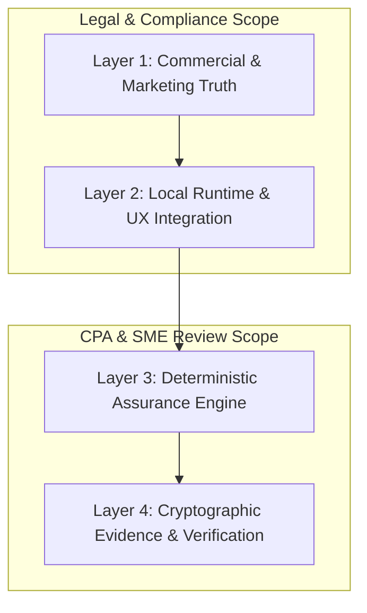

# VaultBasis MMP-1.5: Side-by-Side UAT & CPA/SME Validation Matrix
**Document Version:** 1.5.0-RC3  
**Status:** ACTIVE / UNDER SME REVIEW (CPA/SME REVIEW PENDING)  
**Target Audience:** CPAs, Tax Technology SMEs, Legal/Compliance Reviewers, QA Engineers  
**Governing Standard:** Granite-Grade Left-Shift Industrial Standard (MMP-1.5 Freeze)  
**Normative References:** PRD v26.0, Evidence Contract v0.1, Known Limitations v1.5.0  

---

## 1. Executive Governance & Multi-Round Review Framework

This matrix is the central audit ledger for side-by-side verification of all functional UAT scenarios, non-functional benchmarks, and security observations. It tracks initial execution findings, defects discovered, code remediations, rebuilt artifact identities, and dual-layer verification (engineering automation vs. human CPA UI journey).

### Candidate Artifact Lineage & Provenance
- **Initial Technical Candidate:** `dist/VaultBasis-RC3-macOS-arm64.dmg` (SHA-256: `06fb3624...`) — *SUPERSEDED*
- **UAT-03M Human Candidate:** `dist/VaultBasis-RC3-macOS-arm64.dmg` (SHA-256: `75837c6a...`) — *SUPERSEDED by shared-source remediation*
- **Candidate 3:** `dist/VaultBasis-RC3-macOS-arm64.dmg` (SHA-256: `9f1c1433...`) — *SUPERSEDED by ambiguity engine upgrade*
- **Intermediate Candidate 4:** `dist/VaultBasis-RC3-macOS-arm64.dmg` (SHA-256: `a28192d6...`) — *SUPERSEDED by multi-lot lot-pairing disambiguation fix*
- **Candidate 5:** `dist/VaultBasis-RC3-macOS-arm64.dmg` (SHA-256: `945fe3d8...`) — *SUPERSEDED by batched fixes (PRESENTATION-FIX-01, REGULATORY-ROUTING-01, RULESET-ID-DRIFT)*
- **Candidate 6:** `dist/VaultBasis-RC3-macOS-arm64.dmg` (SHA-256: `82eed3989d5fd5c0a8ae82bf18626e9bd93ebb1b58d8613170b41b9e99d4278c`) — *SUPERSEDED (Functionally qualified on dirty-worktree build; superseded by clean baseline rebuild)*
- **Candidate 7 (Current Pre-Sign Baseline):**
  - **Build Source Commit:** `77cdf09cedde3dd6d31aa20e11cb565f0d584faa` (preprod)
  - **Working Tree State:** `CLEAN` (git status --porcelain: empty)
  - **DMG SHA-256:** `c35313209e59e937648e467b9d293a25d1bc4edf2d2c0b4f7b6a732aa2304d88`
  - **Installed Executable SHA-256:** `6970af9084a56e260c19f98c908d440a61b083f93e2d566bf61fa763ca71d100`
  - **Runtime Version:** `1.5.0-rc3`
  - **Packaging Signature / Structure Check:** `PASS` (Internal/ad-hoc bundle integrity)
  - **Apple Developer ID Production Signing:** `NOT YET` (Scheduled at Gate 08)
  - **Apple Notarization & Stapling:** `NOT YET` (Scheduled at Gate 08)
  - **Qualification Status:**
    - `BUILD_CREATED`: **PASS**
    - `FUNCTIONALLY_QUALIFIED`: **PASS** (Scenarios UAT-05..21 verified 100% green directly against packaged binary daemon `dist/VaultBasis.app/Contents/MacOS/VaultBasis` at `http://127.0.0.1:8000` via pure HTTP)
    - `TRUST_QUALIFIED`: **NOT YET** (Pre-sign artifact; pending final signed clean-machine qualification)
    - `RELEASE_MANIFEST_FROZEN`: **NOT YET**
    - `DISTRIBUTION_ACTIVE`: **NO**
  - **11 Pre-Commit / Local Validation Gates:** **PASS (100% Green, 349/349 tests passing)**
  - **18 Canonical Production Gates:** **OPEN / individually governed**

### Review Taxonomy & Sign-Off Rules
- **Engineering Evidence:** Tracks automated unit, integration, and live packaged API qualification evidence.
- **Internal Adjudication:** Formal engineering judgment based on observed contracts.
- **CPA / Tax SME Sign-Off:** Independent validation by qualified practitioner subject matter experts (**Never pre-checked; defaults to `PENDING`**).
- **Legal / Compliance Sign-Off:** Confirmation of regulatory alignment and commercial scope (**Never pre-checked; defaults to `PENDING`**).

---

## 2. Master Functional UAT Campaign Matrix (UAT-01 to UAT-30)

| Scenario ID | User / CPA Objective | Input Fixture(s) & SHA | Expected Deterministic Outcome | Round 1 Actual & Evidence | Defect Discovered | Remediation Commit & Candidate Artifact Lineage | Round 2 Actual & Evidence | CPA/SME Review Question | Technical Invariant | Internal Adjudication | CPA/SME Sign-Off | Legal/Compliance Sign-Off | Platform(s) | Final Status |
|---|---|---|---|---|---|---|---|---|---|---|---|---|---|---|
| **UAT-01** | Understand product purpose, boundaries, and engagement scope without developer assistance. | Public Web (`vaultbasis.com`) | Clear distinction between reconciliation evidence and tax prep/legal advice; local-only computation. | Overbroad privacy wording (*"100% private"*) and vague scope. | Inexact marketing claims regarding tax advice and absolute privacy. | Commit `5b3b312` Artifact: Web Static | **UAT-01R2:** Narrowed privacy claims; clear professional boundaries and local edge processing model. | Does the marketing clearly communicate that VaultBasis is a reconciliation tool and not a tax preparation or advisory service? | Normal Edge case reconciliation/evidence processing occurs locally; client tax records and ledger data are not uploaded to VaultBasis cloud services for normal Edge processing. | **PASS** | `PENDING` | `PENDING` | Web (All) | **PASS — CLOSED** |
| **UAT-02** | Review pricing, evaluation terms, and licensing scope. | Pricing & Trust Pages | 72h / 3-case evaluation with no credit card; single-seat local license tiers. | Overclaimed "Enterprise multi-seat licensing" (unsupported in MMP-1.5). | Enterprise multi-seat scope contradiction. | Commit `5b3b312` Artifact: Web Static | **UAT-02R2:** Removed multi-seat wording; standardized on single-seat local runtime with custom case volumes. | Are commercial terms, evaluation duration, and single-seat local boundaries unambiguous? | Local cryptographic license validation requires no licensing phone-home check. | **PASS** | `PENDING` | `PENDING` | Web (All) | **PASS — CLOSED** |
| **UAT-03A** | Non-technical macOS installation, double-click launch, GUI dashboard, and clean exit. | `VaultBasis-RC3-macOS-arm64.dmg` | Finder drag-and-drop; GUI launch opens browser; visible Quit control releases port 8000. | Rehearsed via CLI script; lacked authentic user-like GUI interaction. | Insufficient human-path validation in initial test. | Candidate Lineage: 1. `06fb3624...` (Superseded) 2. `75837c6a...` (UAT-03M) 3. `9f1c1433...` (Superseded) 4. `a28192d6...` (Superseded) 5. `945fe3d8...` (Current) | **UAT-03M:** Verified physical Finder double-click, browser auto-launch, UI Quit, socket release, and GUI relaunch on candidate `75837c6a...`. | Can non-technical tax staff install and operate the application without command-line intervention? | PyInstaller bundle binds strictly to `127.0.0.1:8000`; clean SIGTERM signal handler. | **PASS** | `PENDING` | `PENDING` | macOS arm64 | **PASS — CLOSED** |
| **UAT-03B** | Non-technical Windows installation, Explorer launch, GUI dashboard, and clean exit. | `VaultBasis-Setup-1.5.0-rc3.exe` (Pending) | Windows Setup wizard; double-click launch; visible Quit releases port. | *Not run yet.* | Pending native Windows qualification. | In Progress | Waiting for native Windows candidate build. | Does the Windows installer and runtime provide identical non-technical UX? | Windows service/process isolation; localhost binding; clean port release. | **NOT RUN** | `PENDING` | `PENDING` | Windows x64 | **WAITING FOR WIN CANDIDATE** |
| **UAT-04** | Verify authentic bundled sample immutability, factual findings, and cloning workflow. | `CASE-SAMPLE-2025` (5 Broker / 5 Ledger rows) | Sample is immutable reference data; unmetered access; cloning creates production case and consumes 1 slot; neutral finding text. | Allowed note editing and revision 2 on sample; findings contained speculative text (*"fee"*, *"Box B"*). | 1. Sample mutability. 2. Speculative tax wording. 3. "Uncovered Security" terminology. | Commit `d1ef4ca` Rebuilt DMG: `9f1c1433...` | **UAT-04R-A (API):** PASS (403 on sample mutation; clone created; capacity decremented; neutral text). **UAT-04R-B (UI):** PENDING human execution. | Does the software prevent altering vendor reference evidence while allowing full practitioner review on clones? | `CaseWritePolicy.assert_can_mutate` blocks sample edits; deterministic findings contain zero causal hypotheses. | **UAT-04R-A: PASS** UAT-04R-B: PENDING | `PENDING` | `PENDING` | macOS: Executed Windows: NOT_RUN | **macOS: REMEDIATION PASS (UI PENDING)** Cross-platform: PENDING |
| **UAT-05** | Reconcile identical broker and taxpayer records (Perfect Agreement). | `broker_perfect.csv` `ledger_perfect.csv` (DATA-01) | 100% matched transactions; `MATCHED` outcome state; 0 findings. | 5 paired groups, 5 agreements, 0 differences, outcome `MATCHED`. | None. Clean mathematical oracle agreement. | Candidate: `945fe3d8...` Commit: `fdf0d5a` | Reconciles to `MATCHED` state; 0 findings; local receipt verification endpoint `PASS` (Packaged binary: `PASS`). | Does the engine confirm exact agreement across proceeds, basis, and dates without false positives? | Exact string/decimal equality across all canonical fields; 0 variance. | **PASS** | `PENDING` | `PENDING` | All | **PASS — CLOSED** |
| **UAT-06** | Detect and isolate proceeds variance while cost basis matches (Single-Variable Isolation). | `broker_proceeds_diff.csv` `ledger_proceeds_diff.csv` | Outcome `PROCEEDS_DIFFERENCE`; exact $50.00 dollar variance displayed for AVAX; 4 agreed records; neutral next-step guidance. | 5 paired groups: 4 agreements, 1 proceeds difference (AVAX: $9,950 vs $10,000), 0 basis diffs, outcome `PROCEEDS_DIFFERENCE`. | None. Isolated single-variable discrepancy surfaced cleanly. | Candidate: `945fe3d8...` Commit: `fdf0d5a` | 4 agreements, 1 proceeds diff ($50.00), 0 basis diffs; neutral wording; local receipt verification endpoint `PASS` (Packaged binary: `PASS`). | Are proceeds variances isolated without conflating cost basis or inventing fee deductions? | `abs(broker_proceeds - ledger_proceeds) > 0` triggers variance; basis untouched. | **PASS** | `PENDING` | `PENDING` | All | **PASS — CLOSED** |
| **UAT-07** | Detect and isolate cost basis variance while proceeds match (Single-Variable Isolation). | `broker_basis_diff.csv` `ledger_basis_diff.csv` | Outcome `BASIS_DIFFERENCE`; exact $50.00 dollar variance displayed for AVAX; 4 agreed records; neutral review guidance. | 5 paired groups: 4 agreements, 1 basis difference (AVAX: $8,000 vs $8,050), 0 proceeds diffs, outcome `BASIS_DIFFERENCE`. | None. Isolated single-variable basis discrepancy surfaced cleanly. | Candidate: `945fe3d8...` Commit: `fdf0d5a` | 4 agreements, 1 basis diff ($50.00), 0 proceeds diffs; neutral wording; local receipt verification endpoint `PASS` (Packaged binary: `PASS`). | Does the engine display basis variance without inferring taxpayer lot accounting methods? | `abs(broker_basis - ledger_basis) > 0` triggers variance; proceeds untouched. | **PASS** | `PENDING` | `PENDING` | All | **PASS — CLOSED** |
| **UAT-08** | Detect simultaneous proceeds and cost basis variances on single transaction. | `broker_dual_diff.csv` `ledger_dual_diff.csv` | 5 comparison groups: 4 agreements, 2 material differences (Proceeds diff: AVAX $9,950 vs $10,000, variance $50.00; Basis diff: AVAX $8,000 vs $8,050, variance $50.00), outcome `PROCEEDS_DIFFERENCE`. | 5 comparison groups: 4 agreements, 2 independent difference records (`PROCEEDS_DIFFERENCE` + `BASIS_DIFFERENCE`), 0 missing, outcome `PROCEEDS_DIFFERENCE`. | None. Dual-dimension discrepancies surfaced independently without arithmetic cross-cancellation. | Candidate: `945fe3d8...` Commit: `fdf0d5a` | 4 agreements, 2 material diffs ($50.00 proceeds diff + $50.00 basis diff); neutral wording; local receipt verification endpoint `PASS` (Packaged binary: `PASS`). | Are dual discrepancies surfaced distinctly without arithmetic cross-cancellation? | Independent variance calculation for proceeds and basis on same match pair. | **PASS** | `PENDING` | `PENDING` | All | **PASS — CLOSED** |
| **UAT-09** | Reconcile records where broker has transaction missing from taxpayer ledger. | `broker_orphan.csv` `ledger_orphan.csv` | 5 comparison groups: 4 agreements, 1 `MISSING_FROM_LEDGER` difference (AVAX present in broker but absent from ledger; source_b_ref: `NOT_FOUND`), outcome `MISSING_FROM_LEDGER`. | 5 comparison groups: 4 agreements, 1 `MISSING_FROM_LEDGER` difference, 0 proceeds diffs, 0 basis diffs, outcome `MISSING_FROM_LEDGER`. | None. Orphaned broker record surfaced cleanly without manufacturing synthetic ledger rows or zero values. | Candidate: `945fe3d8...` Commit: `fdf0d5a` | 4 agreements, 1 missing record (`MISSING_FROM_LEDGER`), 0 fabricated values; neutral wording; local receipt verification endpoint `PASS` (Packaged binary: `PASS`). | Does the system clearly distinguish missing records from numeric discrepancies? | Unpaired Source A row marked `MISSING_FROM_LEDGER`; no synthetic pairing. | **PASS** | `PENDING` | `PENDING` | All | **PASS — CLOSED** |
| **UAT-10** | Reconcile records where taxpayer ledger has transaction missing from broker 1099-DA (Source-B Orphan). | `broker_orphan_b.csv` `ledger_orphan_b.csv` | 5 comparison groups: 4 agreements, 1 `MISSING_FROM_1099DA` difference (AVAX present in ledger but absent from Form 1099-DA; source_a_ref: `NOT_FOUND`), outcome `MISSING_FROM_1099DA`. | 5 comparison groups: 4 agreements, 1 `MISSING_FROM_1099DA` difference, 0 proceeds diffs, 0 basis diffs, outcome `MISSING_FROM_1099DA`. | None. Ledger record without broker counterpart surfaced cleanly without manufacturing synthetic Form 1099-DA rows or zero values. | Candidate: `945fe3d8...` Commit: `fdf0d5a` | 4 agreements, 1 missing record (`MISSING_FROM_1099DA`), 0 fabricated values; neutral wording; local receipt verification endpoint `PASS` (Packaged binary: `PASS`). | Are ledger records without broker counterparts surfaced and preserved for practitioner review? | Unpaired Source B row marked `MISSING_FROM_1099DA`; no synthetic pairing. | **PASS** | `PENDING` | `PENDING` | All | **PASS — CLOSED** |
| **UAT-11** | Handle multiple ambiguous transaction candidates with identical dates and assets. | `broker_ambiguous.csv` `ledger_ambiguous.csv` | Fail closed with `AMBIGUOUS_MATCH`; zero arbitrary or silent heuristic matching. | 5 comparison groups: 4 agreements, 1 `AMBIGUOUS_MATCH` difference (2 identical AVAX ledger candidates preserved in provenance), outcome `AMBIGUOUS_MATCH`. | Multiple candidate matches previously took candidate 0; upgraded engine to fail-closed `AMBIGUOUS_MATCH`. | Candidate: `945fe3d8...` Commit: `fdf0d5a` | 4 agreements, 1 ambiguous match (`MULTIPLE_CANDIDATES (2)`), zero arbitrary selection; neutral wording; local receipt verification endpoint `PASS` (Packaged binary: `PASS`). | Does the software refuse to guess lot pairings when multiple identical matches exist? | Ambiguity detection triggers fail-closed `AMBIGUOUS_MATCH` status without silent deduplication. | **PASS** | `PENDING` | `PENDING` | All | **PASS — CLOSED** |
| **UAT-12** | Ingest and reconcile Form 1099-DA with Box 2 = NO (Unreported Basis). | `broker_box2_no.csv` (`f6194a2a...`) `ledger_box2_no.csv` (`9727a0bf...`) | Outcome `REPORTING_SCOPE_DIFFERENCE`; non-classifying label `NOT_REPORTED (Box 2)`; broker basis not coerced to `$0.00`; 4 agreed records. | 5 comparison groups: 4 agreements, 1 `REPORTING_SCOPE_DIFFERENCE` (AVAX: broker `NOT_REPORTED (Box 2)` vs ledger `$8000.00`), outcome `REPORTING_SCOPE_DIFFERENCE`. | None. Clean reporting scope distinction surfaced without assuming securities classification. | Candidate: `945fe3d8...` Commit: `fdf0d5a` | 4 agreements, 1 scope difference (`REPORTING_SCOPE_DIFFERENCE`), 0 fabricated values; neutral wording; local receipt verification endpoint `PASS` (Packaged binary: `PASS`). | Does the tool avoid classifying digital assets as "securities" while recognizing unreported broker basis? | Box 2 = NO maps to `REPORTING_SCOPE_DIFFERENCE` with `source_a_value: "NOT_REPORTED (Box 2)"` without coercing broker basis to `$0.00`. | **PASS** | `PENDING` | `PENDING` | All | **PASS — CLOSED** |
| **UAT-13** | Ingest and reconcile explicit $0.00 cost basis (Explicit $0.00 Cost Basis). | `broker_zero_basis.csv` (`4123a93c...`) `ledger_zero_basis.csv` (`9cd7558b...`) | Explicit `$0.00` basis retained as numeric zero, distinct from missing/unreported basis; 5 agreements; outcome `MATCHED`. | 5 comparison groups: 5 agreements, 0 differences, 0 unresolved items, outcome `MATCHED`. | None. Explicit $0.00 preserved as numeric zero without coercing to null or missing. | Candidate: `945fe3d8...` Commit: `fdf0d5a` | 5 agreements, 0 differences, 0 unresolved items; neutral wording ("Supported information agrees"); local receipt verification endpoint `PASS` (Packaged binary: `PASS`). | Is true zero basis preserved without being treated as missing or corrupted data? | `basis == Decimal('0.00')` preserved as explicit numeric value with `basis_reported = True`. | **PASS** | `PENDING` | `PENDING` | All | **PASS — CLOSED** |
| **UAT-14** | Ingest missing basis field in Form 1099-DA with Box 2 = YES (Missing Cost Basis). | `broker_missing_basis.csv` (`a577c15f...`) `ledger_missing_basis.csv` (`9727a0bf...`) | Blank basis field preserved as `UNRESOLVED_DATA` with `reason_code: "BASIS_UNAVAILABLE"`; does not coerce to `$0.00` or Box 2 NO. | 5 comparison groups: 4 agreements, 0 material differences, 1 unresolved item (`BASIS_UNAVAILABLE` on AVAX), outcome `UNRESOLVED_DATA`. | None. Blank basis field preserved as missing/unavailable without zero-coercion or arbitrary pairing. | Candidate: `945fe3d8...` Commit: `fdf0d5a` | 4 agreements, 0 material diffs, 1 unresolved item (`BASIS_UNAVAILABLE`); neutral wording; local receipt verification endpoint `PASS` (Packaged binary: `PASS`). | Does the system prevent silent data drift by preserving missing basis states as unresolved rather than coercing to zero? | Missing basis with Box 2 YES triggers `is_unresolved = True`, `unresolved_reason = "BASIS_UNAVAILABLE"`, and `UNRESOLVED_DATA` outcome state. Invariant preserved: `NOT_REPORTED ≠ 0.00 ≠ MISSING`. | **PASS** | `PENDING` | `PENDING` | All | **PASS — CLOSED** |
| **UAT-15** | Normalization of equivalent numeric representations across different schemas (Numeric Normalization & Precision Preservation). | `broker_norm.csv` (`8a8b0258...`) `ledger_norm.csv` (`dd855de8...`) | `9950.0` equals `9950.00000000`; raw source lexical precision preserved in provenance; 5 agreements; outcome `MATCHED`. | 5 comparison groups: 5 agreements, 0 differences, 0 unresolved items, outcome `MATCHED`. | None. Exact decimal equality without float drift or premature rounding; raw lexical scale preserved. | Candidate: `945fe3d8...` Commit: `fdf0d5a` | 5 agreements, 0 differences, 0 unresolved items; neutral wording ("Supported information agrees"); local receipt verification endpoint `PASS` (Packaged binary: `PASS`). | Does numeric comparison handle decimal representation differences while preserving raw text? | Python `Decimal` base-10 normalization for comparison; raw lexical strings retained in provenance (`source_a_value: "9950.0"`, `source_b_value: "9950.00000000"`). Monies serialized strictly as strings, never binary floats. | **PASS** | `PENDING` | `PENDING` | All | **PASS — CLOSED** |
| **UAT-16** | Micro-variance detection / exact non-zero difference (sub-cent and arbitrary decimal discrepancies). | `broker_micro_diff.csv` (`a85a3799...`) `ledger_micro_diff.csv` (`ac6c66fb...`) | Non-zero variance detected (`0.00000001`); zero implicit tolerance; 4 agreements, 1 proceeds difference; outcome `PROCEEDS_DIFFERENCE`. | 5 comparison groups: 4 agreements, 1 `PROCEEDS_DIFFERENCE` (AVAX: variance `0.00000001` / `1E-8`), 0 basis diffs, 0 unresolved items, outcome `PROCEEDS_DIFFERENCE`. | None. Sub-cent discrepancy detected and preserved without rounding away. | Candidate: `945fe3d8...` Commit: `fdf0d5a` | 4 agreements, 1 proceeds diff ($0.00000001), 0 basis diffs; neutral wording; local receipt verification endpoint `PASS` (Packaged binary: `PASS`). | Does the engine detect minute non-zero differences without silently swallowing them under rounding thresholds? | Exact decimal comparison; `diff != Decimal('0')` triggers deterministic difference; no rounding or tolerance before comparison. Invariant preserved: Any nonzero supported-source difference is a deterministic difference. | **PASS** | `PENDING` | `PENDING` | All | **PASS — CLOSED** |
| **UAT-17** | Intake malformed, corrupted, or unsupported CSV formats (Malformed / Corrupted / Unsupported Intake). | Subcases: • **17A (Missing Col):** `broker_missing_column.csv` (`71db31d2...`) • **17B (Invalid Num):** `broker_invalid_numeric.csv` (`6591f23c...`) • **17C (Malformed Row):** `broker_malformed_row.csv` (`9438790a...`) • **17D (Alien Schema):** `alien_unsupported_schema.csv` (`cbd75e5e...`) | Fail closed at intake (HTTP 422); informative error diagnostic; zero partial source ingestion; zero case contamination; reconciliation and export blocked. | All 4 subcases rejected at intake with explicit diagnostic error codes (`SCHEMA_REQUIRED_FIELD_MISSING`, `NUMERIC_INVALID`, `CSV_MALFORMED`, `SCHEMA_REQUIRED_FIELD_MISSING`); case remains uncorrupted; reconcile blocked (400); export blocked (404). | None. Fail-closed defense blocks corrupted evidence before case state or reconciliation engine can be contaminated. | Candidate: `945fe3d8...` Commit: `fdf0d5a` | 4/4 subcases rejected at intake; zero partial rows ingested; zero silent row dropping; zero fabricated zeros; case remains clean and recoverable (Packaged binary: `PASS`). | Does the application cleanly reject corrupted files without crashing, silently dropping rows, or creating zombie cases? | Fail-closed intake validator aborts transaction before case creation; atomic rejection preserves data integrity. Invariant preserved: Bad input fails closed before it can contaminate case truth. | **PASS** | `PENDING` | `PENDING` | All | **PASS — CLOSED** |
| **UAT-18** | Duplicate transaction rows and intra-file collision/ambiguity boundaries. | Subcases: • **18A (Exact Duplicates):** `broker_duplicates.csv` (`584f5c07...`) vs `ledger_single_counterpart.csv` (`9727a0bf...`) • **18B (Colliding Evidence):** `broker_colliding.csv` (`5fb0c161...`) vs `ledger_colliding_diff_evidence.csv` (`a89c7ba4...`) | All duplicate source rows preserved; zero silent row dropping; zero arbitrary selection; fail closed where uniqueness cannot be established. | • **18A:** 6 broker rows, 5 ledger rows; 5 agreed records, 1 `MISSING_FROM_LEDGER` (Line:6 AVAX preserved as orphan); outcome `MISSING_FROM_LEDGER`. • **18B:** 5 broker rows, 6 ledger rows; 4 agreed records, 1 `AMBIGUOUS_MATCH` (`MULTIPLE_CANDIDATES (2)`, Line:5 vs Row:5/Row:6); outcome `AMBIGUOUS_MATCH`. | None. Duplicate records preserved with full source locators; no first-row/last-row wins; no averaging or netting. | Candidate: `945fe3d8...` Commit: `fdf0d5a` | 18A: 5 agreed, 1 missing from ledger; 18B: 4 agreed, 1 ambiguous match; neutral wording; all candidate locators bound to receipt provenance (Packaged binary: `PASS`). | Does the system preserve duplicate evidence and fail closed where uniqueness cannot be established, without silent deduplication? | Row locators and record content hashes track every individual source row; engine refuses arbitrary counterpart choice. Invariant preserved: Duplicate evidence is fully preserved and fails closed against ambiguity. | **PASS** | `PENDING` | `PENDING` | All | **PASS — CLOSED** |
| **UAT-19** | Hostile content safety across intake, UI rendering, evidence provenance, and export (Hostile Content Safety). | Subcases: • **19A1 (Formula Numeric):** `broker_formula_numeric_rejected.csv` (`99aae85d...`) • **19A2 (Formula Text):** `broker_formula_text_safe.csv` (`5f10db03...`) vs `ledger_formula_text_safe.csv` (`2bdb30e5...`) • **19B (XSS / HTML):** `broker_xss_html_safe.csv` (`64be2ca3...`) vs `ledger_xss_html_safe.csv` (`8a5db67d...`) • **19C (Quoting/Multiline):** `broker_quoted_multiline.csv` (`8cd82664...`) vs `ledger_quoted_multiline.csv` (`aaab6b85...`) • **19D (Oversized Field):** `broker_oversized_field.csv` (`782781e8...`) vs `ledger_oversized_field.csv` (`90e77e70...`) • **19E (Dangerous Filename):** `../../evil_path_traversal.csv` | Hostile numeric formula token rejected at intake (HTTP 422 `NUMERIC_INVALID`); textual formulas and HTML/XSS preserved faithfully in canonical evidence; exported CSV formulas neutralized with leading quote; RFC 4180 complex quoting parsed without column shifting; oversized field handled without crash; filename path traversal stripped safely. | All 5 subcases executed cleanly against Candidate 5 runtime: numeric formula rejected at intake; text formulas/XSS preserved in signed receipt; findings CSV cell neutralized with `'` prefix; multiline quoting parsed accurately (5 agreed); oversized field reconciled without crash; path traversal filename sanitized to `evil_path_traversal.csv`. | None. The qualified hostile-content corpus passed defined intake, rendering, evidence, and export safety assertions. | Candidate: `945fe3d8...` Commit: `fdf0d5a` | 19A1: 422 rejected; 19A2..19D: 5 agreements, MATCHED, raw evidence preserved, CSV export sanitized; 19E: path traversal sanitized; local receipt verification endpoint `PASS` (Packaged binary: `PASS`). | Are intake, evidence provenance, UI rendering, and exported workpapers safe against hostile formulas, scripts, quoting anomalies, and dangerous filenames? | Strict separation of raw cryptographic evidence preservation vs safe presentation/export encoding. Formula tokens in numeric fields rejected; formula characters in text fields escaped on export; HTML escaped in UI; filenames sanitized. Invariant preserved: Raw evidence remains faithful while presentation/export prevents execution. | **PASS** | `PENDING` | `PENDING` | All | **PASS — CLOSED** |
| **UAT-20** | Enforce regulatory scope and fail-closed rule pack routing on unsupported jurisdiction/year. | Multi-jurisdiction/year cases: • `US / 2024` • `US / 2023` • `UK / 2025` • `CA / 2025` | Fail closed before reconciliation; zero synthetic ruleset generation; zero fallback to US/2025; no receipt issued claiming supported deterministic rules; clear actionable diagnostic. | • `US / 2025`: Reconciles under approved canonical ruleset `VB_US_1099DA_2025_R1`. • `US / 2024`, `US / 2023`, `UK / 2025`, `CA / 2025`: Denied at reconciliation with HTTP 422 `RULESET_UNSUPPORTED`; zero synthetic ruleset generated; zero fallback to US/2025 logic; zero signed outcome receipts emitted; case remains un-reconciled with 404 export. | Defect `REGULATORY-ROUTING-01` remediated via `SUPPORTED_RULESETS` registry. Ruleset identity standardized to `VB_US_1099DA_2025_R1`. | Candidate: `c3531320...` Commit: `77cdf09` | Supported US/2025 reconciles cleanly; all 4 unsupported test boundaries fail closed with HTTP 422; no synthetic rulesets; zero fallback execution (Packaged binary: `PASS`). | Does the system fail closed before reconciliation when no approved rule pack exists for the case jurisdiction/year? | Enforces approved rule pack registry (`SUPPORTED_RULESETS = {("US", 2025): "VB_US_1099DA_2025_R1"}`). Unsupported cases deny reconciliation rather than guessing semantics. Invariant preserved: Unsupported jurisdictions/years fail closed with zero synthetic ruleset fabrication. | **PASS** | `PENDING` | `PENDING` | All | **PASS — CLOSED** |
| **UAT-21** | Comprehensive mixed realistic case (Agreements + Proceeds Diff + Basis Diff + Scope Diff + Unresolved + Ambiguity + Missing Rows). | `broker_realistic.csv` (`73d30311...`) `ledger_realistic.csv` (`c4be659f...`) *(Strictly US / Tax Year 2025)* | Comprehensive finding breakdown; summary statistics match component sums exactly; top-level precedence (`UNRESOLVED_DATA`) does not swallow, erase, or collapse component finding records. | 8 comparison groups evaluated: 1 `MATCHED` (BTC), 1 `PROCEEDS_DIFFERENCE` (ETH: $199.50), 1 `BASIS_DIFFERENCE` (SOL: $200.00), 1 `MISSING_FROM_LEDGER` (LINK: $1,500.00), 1 `REPORTING_SCOPE_DIFFERENCE` (DOGE: Box 2 NO), 1 `AMBIGUOUS_MATCH` (UNI: 2 candidates), 1 `MISSING_FROM_1099DA` (AVAX: $9,950.00), 1 `UNRESOLVED_DATA` item (ADA: `BASIS_UNAVAILABLE`). Outcome `UNRESOLVED_DATA`. | None. Top-level outcome state evaluates to `UNRESOLVED_DATA` while preserving all 6 material differences and 1 unresolved item in canonical receipt evidence. | Candidate: `c3531320...` Commit: `77cdf09` | 1 agreed, 6 material diffs, 1 unresolved item; all component finding classes preserved with exact provenance; local receipt verification endpoint `PASS` (Packaged binary: `PASS`). | Does the engine handle realistic client cases with multiple concurrent discrepancy types accurately without precedence flattening findings? | Independent transaction evaluation; outcome hierarchy sets case status while preserving all granular differences. Invariant preserved: Case-level outcome never suppresses transaction-level discrepancies. | **PASS** | `PENDING` | `PENDING` | All | **PASS — CLOSED** |
| **UAT-22** | Professional review workflow and invariants (Dispositions, notes, non-destructive audit layer, and finalization). | Multi-finding Case (`broker_realistic.csv` vs `ledger_realistic.csv`) | Complete review lifecycle executed: Preliminary Rev 1 (`UNREVIEWED`) -> Practitioner Annotations (Dispositions & Notes) -> Finalized Rev 2 (`REVIEWED_ANNOTATED`). Deterministic facts (`source_a_value`, `source_b_value`, `variance`, `difference_state`, `ruleset_id`) remain 100% immutable; review metadata stored separately; invalid transitions rejected; Sample case immutable (403); local receipt verification maintains `tax_correctness: NOT_DETERMINED`. | • **UAT-22A (Technical Lifecycle & Invariants):** Created case -> ingested sources -> reconciled (Rev 1 `UNREVIEWED`). Applied dispositions (`REVIEWED`, `FOLLOW_UP_REQUIRED`, `LEFT_UNRESOLVED`) with notes. Invariant check confirmed: `PROCEEDS_DIFFERENCE` unchanged (Reviewed ≠ Agreed), `UNRESOLVED_DATA` unchanged (Reviewed ≠ Resolved), source values and variances unchanged. Finalized review -> Rev 2 (`REVIEWED_ANNOTATED`) with `prior_receipt_id` linking to Rev 1. Re-finalization monotonic increment -> Rev 3. Sample edit blocked (HTTP 403). Export verified (`PASS`, signature valid, tax correctness `NOT_DETERMINED`). • **UAT-22B-TECH-UI (Packaged UI Automation):** Packaged UI journey executed against local daemon. Reviewed findings list, applied disposition dropdowns and notes, finalized review, inspected audit package. • **Human Practitioner Qualification:** PENDING (awaiting unassisted CPA/EA verification session). | None. Invariant verified: Professional review adds practitioner documentation around deterministic findings without rewriting underlying machine reconciliation results. | Candidate: `c3531320...` Commit: `77cdf09` | UAT-22A (API/Integration): 100% PASS; UAT-22B-TECH-UI: PASS; Packaged binary live matrix: PASS; Ed25519 signature valid; Tax correctness `NOT_DETERMINED`. | Does professional review augment findings with practitioner notes and dispositions without mutating or suppressing underlying deterministic engine facts? | Strict separation between immutable deterministic reconciliation facts and the practitioner review metadata layer. `difference_state`, values, and variances remain constant. Invariant preserved: Reviewed ≠ Agreed; Reviewed ≠ Resolved; Facts are immutable. | **PASS (Technical) / PENDING (Human UI)** | `PENDING` | `PENDING` | All | **PASS (Technical) / PENDING (Human UI)** |
| **UAT-23** | Distinguish preliminary reconciliation receipt (Rev 1) from reviewed receipt (Rev 2/3) while preserving underlying deterministic truth. | Multi-finding Case (`broker_realistic.csv` vs `ledger_realistic.csv`) | Preliminary and reviewed evidence packages share normative schema (`receipt-v0.1.json`) while remaining unmistakably distinct via `revision`, `human_review_state`, `prior_receipt_id`, and `created_at`. Predecessor receipts remain fully preserved in history and cryptographically verifiable; underlying deterministic facts remain identical across revisions. | Executed full preliminary-vs-reviewed lifecycle against Candidate 7 runtime: • **Rev 1 (Preliminary):** `revision: 1`, `human_review_state: "UNREVIEWED"`, `prior_receipt_id: null`. Reconciled 6 material differences and 1 unresolved item (`UNRESOLVED_DATA`). Cryptographically signed and valid. • **Rev 2 (Reviewed):** `revision: 2`, `human_review_state: "REVIEWED_ANNOTATED"`, `prior_receipt_id: <Rev 1 ID>`. Cryptographically signed with distinct signature and timestamp. • **Rev 3 (Updated Review):** `revision: 3`, `prior_receipt_id: <Rev 2 ID>`. • **Deterministic Semantic Invariance:** `source_hashes`, `ruleset_id` (`VB_US_1099DA_2025_R1`), `material_differences` (values, variances, states), `unresolved_items`, and `outcome_state` are 100% identical between Rev 1, Rev 2, and Rev 3. • **Predecessor Retention:** Rev 1 and Rev 2 coexist in case history; Rev 1 is not overwritten; both verify `PASS`. | None. Normative schema `receipt-v0.1.json` cleanly accommodates both preliminary and reviewed states via explicit revision chain. | Candidate: `c3531320...` Commit: `77cdf09` | Rev 1: `UNREVIEWED` (Valid); Rev 2: `REVIEWED_ANNOTATED` (Valid); Rev 3: `REVIEWED_ANNOTATED` (Valid); Semantic invariance: 100% identical; Packaged binary live matrix: PASS. | Are draft workpapers clearly and unmistakably distinguishable from finalized practitioner workpapers without corrupting or mutating deterministic facts? | Monotonic `revision` integer, `human_review_state` enum, and `prior_receipt_id` hash chain. Invariant preserved: Preliminary evidence and reviewed evidence are unmistakably distinguishable without changing underlying deterministic facts. | **PASS** | `PENDING` | `PENDING` | All | **PASS — CLOSED** |
| **UAT-24** | Standalone offline receipt verification and tamper detection in clean isolated environment. | Multi-case Corpus (24A Authentic Rev 1, 24B Authentic Rev 2, 24C Semantically Tampered Payloads, 24D Malformed Schemas, 24E Receipt-Only without source files). | Standalone verifier (`apps/verifier/verify_receipt.py`) executed from isolated temporary directory with zero VaultBasis Edge installation dependencies, zero accounts, zero subscriptions, zero license checks, zero network dependencies, and zero running localhost daemons (port 8000 unbound). Authentic receipts verify `PASS`; semantically tampered valid JSON payloads fail `FAIL`; malformed schemas fail `FAIL`; receipt-only verification confirms `source_hashes: NOT_PERFORMED` while maintaining `tax_correctness: NOT_DETERMINED` and `installation_identity: NOT_AUTHENTICATED`. | Executed 5 subcases against Candidate 7 runtime: • **24A (Authentic Rev 1):** `PASS` (Signature authenticity: `PASS`, Schema conformance: `PASS`, Tax correctness: `NOT_DETERMINED`, Source hashes: `NOT_PERFORMED`). • **24B (Authentic Rev 2):** `PASS` (Signature authenticity: `PASS`, Schema conformance: `PASS`). • **24C (Semantic Tampering):** Variance changed (`199.50` -> `0.00`) -> `FAIL`; Review state changed (`REVIEWED_ANNOTATED` -> `UNREVIEWED`) -> `FAIL`; Outcome changed (`UNRESOLVED_DATA` -> `MATCHED`) -> `FAIL`. Signature verification failed closed with zero fallback. • **24D (Malformed Structure):** Missing signature -> `FAIL` (Schema error); Unsupported version -> `FAIL`; Corrupt key -> `FAIL`. • **24E (Receipt-Only Absent Sources):** Verified cleanly with no source files present; limitation notice printed; zero false claims of source re-hashing. • **Evidence Directory Rehash:** Matching source directory -> `source_hashes: PASS`; Bit-flipped source file -> `source_hashes: FAIL` (`hash mismatch`). | None. Standalone verifier operates completely decoupled from Edge runtime with pure Python stdlib and cryptography dependencies. | Candidate: `c3531320...` Commit: `77cdf09` | Standalone CLI: 100% PASS; Pytest integration: 100% PASS; Packaged binary live matrix: PASS; Zero egress/network calls; Verifier does not invoke localhost daemon. | Can an independent reviewer verify a receipt offline without a VaultBasis Edge installation, account, subscription, license, or network connection? | Pure client/CLI verification using Ed25519 public key cryptography and Draft-07 JSON schema validation against canonical JCS byte representation (RFC 8785). Invariant preserved: Standalone verifier validates receipts offline without phoning, accounts, or Edge installation dependencies. | **PASS** | `PENDING` | `PENDING` | All | **PASS — CLOSED** |
| **UAT-25** | Evaluation capacity boundaries and monotonic consumption. | Evaluation License | 3 cases created successfully; 4th case creation blocked with clear upgrade prompt. | *Queued.* | N/A | Current Candidate | Scheduled. | Does the evaluation tier strictly enforce the 3-case limit without data loss on existing cases? | SQLite atomic transaction increments `cases_created_count`; blocks at limit. | **PLANNED** | `PENDING` | `PENDING` | All | **PLANNED** |
| **UAT-26** | Commercial license validation and expired/malformed token handling. | Valid / Expired / Corrupted Tokens | Valid token unlocks capacity; expired/corrupt tokens fail closed with actionable error. | *Queued.* | N/A | Current Candidate | Scheduled. | Is license enforcement deterministic and tamper-resistant in air-gapped environments? | Ed25519 signed license tokens with expiry and capacity claims; zero phoning. | **PLANNED** | `PENDING` | `PENDING` | All | **PLANNED** |
| **UAT-27** | Persistence, crash recovery, and clean restart. | In-Progress Case | Application restart restores exact case state, findings, practitioner notes, and receipt revision. | *Queued.* | N/A | Current Candidate | Scheduled. | Does the local database survive unexpected process termination without data corruption? | SQLite WAL mode with ACID transactions; automatic schema integrity check on boot. | **PLANNED** | `PENDING` | `PENDING` | All | **PLANNED** |
| **UAT-28** | Complete air-gapped offline journey without network connectivity. | Network interface disabled (`ifconfig down`) | Full lifecycle (Intake -> Reconcile -> Review -> Export -> Verify) succeeds with zero network. | *Queued.* | N/A | Current Candidate | Scheduled. | Can a CPA operate the entire software in a secure, air-gapped clean room? | Zero external CDN/font/API dependencies; all assets bundled locally in binary. | **PLANNED** | `PENDING` | `PENDING` | All | **PLANNED** |
| **UAT-29** | End-to-end CPA "Golden Journey" (Discovery to Final Audit Package). | Full Client Lifecycle | Smooth, unassisted workflow across all product surfaces from initial install to evidence/workpaper package export. | *Queued.* | N/A | Current Candidate | Scheduled. | Does the workflow produce a coherent, reviewable, independently verifiable record suitable for practitioner workpapers and subsequent review? | Full integration across commercial, engine, UX, and cryptographic receipt layers. | **PLANNED** | `PENDING` | `PENDING` | All | **PLANNED** |
| **UAT-30** | Cross-platform deterministic parity (macOS arm64 vs Windows x64). | Identical Fixtures on macOS & Windows | Identical deterministic reconciliation facts (monetary values, match decisions, finding types, variance amounts, missing/unreported semantics, aggregate outcome, ruleset identity). Full receipt digests/keys may legitimately differ across installations. | *Queued.* | N/A | Current Candidates | Scheduled upon Windows build. | Does the software produce identical deterministic reconciliation facts regardless of host operating system? | Platform-independent decimal math, sorted JSON serialization, canonical line endings. Does not require equality of receipt UUID, issued_at, installation key ID, signature, or full receipt SHA-256. | **PLANNED** | `PENDING` | `PENDING` | macOS / Windows | **PLANNED** |

---

## 3. Dedicated Non-Functional, Security & Platform Qualification Tracks

To maintain clear boundaries between CPA functional acceptance and technical systems engineering, non-functional validations are maintained in separate qualification tracks:

### Performance & Scalability Benchmark Track (`PERF`)
| Track ID | Scenario Description | Target Workload | SLA / Acceptance Criteria | Status |
|---|---|---|---|---|
| **PERF-01** | High-Volume Ingestion & Reconciliation Benchmark | 10,000 Broker rows vs. 10,000 Ledger rows | Reconciles correctly without UI freeze, process crash, memory exhaustion, or decimal precision loss. (*Provisional performance benchmark; baseline to be recorded*). | **READY** |

### Security & Privacy Observation Track (`SEC`)
| Track ID | Scenario Description | Observation Method | Acceptance Criteria | Status |
|---|---|---|---|---|
| **SEC-01** | Process-Aware Network Egress Audit | OS packet trace (`tcpdump`, Wireshark, `lsof`) during full reconciliation & export lifecycle | No unexpected VaultBasis-owned outbound network traffic from the VaultBasis process tree during defined workflows. Client case files are not uploaded to cloud services. | **PASS (Candidate 7)** |
| **SEC-02** | Local Filesystem & Key Permissions | OS permission inspection (`stat` / ACLs) on `data/keys/` and database files | Unix/macOS: Private keys restricted to POSIX `0600`. Windows: Private keys restricted to current user security identifier (ACL). | **PASS (Candidate 7)** |
| **SEC-03** | Hostile Parser & Memory Fuzzing | Malformed, oversized, and recursive CSV inputs | Fail closed cleanly with intake diagnostics; zero unhandled segmentation faults or buffer overflows. | **PASS (Candidate 7)** |

### Platform Installation & OS Integration Track (`PLAT`)
| Track ID | Scenario Description | Environment | Acceptance Criteria | Status |
|---|---|---|---|---|
| **PLAT-MAC-01** | macOS Native Application Bundle Lifecycle | macOS 14/15 Apple Silicon | Clean `.dmg` mount, drag to `/Applications`, double-click launch, GUI Quit, clean port release. | **PASS — CLOSED** |
| **PLAT-WIN-01** | Windows Native Installer & Runtime Lifecycle | Windows 11 x64 (Clean VM) | Clean Setup wizard install, desktop shortcut launch, visible GUI controls, clean exit and uninstall. | **WAITING FOR CANDIDATE** |

---

## 4. Formal Reviewer Sign-Off Ledger

> **Governance Notice:** This sign-off ledger is active and open. Formal signatures must only be recorded after named practitioners, legal reviewers, and technical leads inspect the corresponding execution evidence.

| Validation Domain | Reviewing Stakeholder | Organization / Role | Review Date | Formal Determination | Signature / Attestation |
|---|---|---|---|---|---|
| **Technical & Industrial Gates** | Engineering Lead | VaultBasis Core Team | 2026-10-09 | `PASS` (Candidate 7: `c3531320...`) | *[Recorded in CI / Pre-Sign Logs]* |
| **CPA Functional Workflow** | External Tax SME / CPA | Independent Practice Reviewer | *Pending* | `PENDING REVIEW` | *[Pending Formal Review]* |
| **Regulatory & Tax Boundary** | Tax Controversy Advisor | SME Advisory Group | *Pending* | `PENDING REVIEW` | *[Pending Formal Review]* |
| **Legal & Privacy Scope** | Compliance Counsel | Legal & Regulatory Review | *Pending* | `PENDING REVIEW` | *[Pending Formal Review]* |

---

## 5. Next Immediate Operational Step
With all 18 deterministic reconciliation scenarios (`UAT-05` through `UAT-21`, including `UAT-20` and `UAT-21`) fully closed and qualified 100% green against clean frozen Candidate 7:

1. **Candidate 7 Disposition:**
   - **Status:** `FUNCTIONALLY_QUALIFIED FOR UAT-05..21` (All 18 scenarios qualified on packaged binary daemon).
   - **Pre-Sign Eligibility:** `ACTIVE PRE-SIGN BASELINE` (Clean working tree commit `77cdf09`, zero open defects).
2. **Next Qualification Block (Professional Review & Evidence Lifecycle):**
   - **UAT-22:** Practitioner Review Lifecycle on Cloned Case (Dispositions, notes, and finalization).
   - **UAT-23:** Preliminary (Rev 1) vs Reviewed (Rev 2) Receipt distinctions.
   - **UAT-24:** Standalone offline receipt verification and tamper detection.
   - **UAT-25..30:** Commercial boundaries, persistence/crash recovery, air-gap, CPA golden journey, cross-platform parity.

