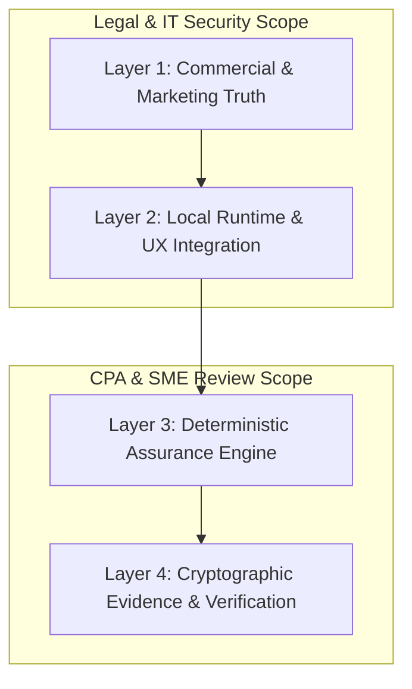

# VaultBasis MMP-1.5: Side-by-Side UAT & CPA/SME Validation Matrix
**Document Version:** 1.5.0-RC3  
**Status:** Authoritative Pre-Sign Validation Matrix  
**Target Audience:** CPAs, Tax Technology SMEs, Legal/Compliance Reviewers, QA Engineers  
**Governing Standard:** Granite-Grade Left-Shift Industrial Standard (MMP-1.5 Freeze)  
**Normative References:** PRD v26.0, Evidence Contract v0.1, Known Limitations v1.5.0  

---

## 1. Executive Framework & CPA/SME Validation Model

When reviewing VaultBasis with CPAs and Tax Technology Subject Matter Experts (SMEs), it is critical to distinguish between four distinct operational layers:



1. **Commercial & Marketing Scope:** Does the product represent itself strictly as a local reconciliation tool without claiming tax-opinion generation, multi-seat capabilities outside single-seat license boundaries, or unwarranted privacy superlatives?
2. **Local Runtime & User Journey:** Can a non-technical practitioner install, launch, evaluate, review, and quit without command-line intervention or external telemetry?
3. **Deterministic Assurance & Professional Semantics:** Does the reconciliation engine strictly compare source facts without inventing causes (e.g. fee assumptions) or prescribing tax treatment (e.g. Form 8949 codes)? Are authentic reference samples kept strictly immutable?
4. **Cryptographic Proofs & Anti-Tamper Verification:** Are workpapers and receipts self-contained, signed with installation-bound Ed25519 keys, and verifiable completely offline?

---

## 2. Master Side-by-Side Scenario Matrix (UAT-01 to UAT-10)

| Scenario ID & Title | Target Surface & Persona | Round 1 Validation (Initial Findings) | Round 2 / Remediated Validation (UAT-R) | CPA / SME Professional Assertion | Technical Mechanism & Invariant | Adjudication Status |
|---|---|---|---|---|---|---|
| **UAT-01**<br>Public Discovery & Engagement Scope | Public Marketing Web (`vaultbasis.com`)<br>*Persona: Managing Partner / Senior CPA* | Tested value proposition, boundaries, and product positioning. Overbroad privacy language detected. | **UAT-01R2:** Narrowed privacy claims. Clarified local-processing model, zero telemetry, and clear professional boundaries. | Product must clearly distinguish reconciliation from tax preparation, legal/tax advice, or source authentication. | Static, commit-bound web app with zero cloud computation or synthetic assumptions. | **PASS — CLOSED** |
| **UAT-02**<br>Commercial Pricing & License Evaluation | Pricing & Trust Pages<br>*Persona: Tax Practice Operations* | Validated 72h evaluation and commercial tiers. Surfaced invalid "multi-seat" claim for Enterprise. | **UAT-02R2:** Removed multi-seat wording. Standardized on single-seat local runtime with custom case volumes. | Pricing, trial limits (72h, 3 cases, no CC), and deployment scope must match actual software capabilities. | Offline air-gapped license token validation; no cloud activation phoning. | **PASS — CLOSED** |
| **UAT-03**<br>Clean OS Install, Launch & Desktop UX | macOS Finder / Win Explorer<br>*Persona: Tax Staff / Non-Tech CPA* | Rehearsed headless launch. Flagged lack of genuine GUI double-click and human interaction path. | **UAT-03M:** Verified physical Finder double-click, auto browser launch, visible dashboard, UI Quit, and socket release. | Software must install and run seamlessly without requiring developer terminal skills or background daemons. | PyInstaller packaged bundle with auto-opening native browser and clean signal termination. | **PASS — CLOSED** |
| **UAT-04**<br>Bundled Sample, Neutral Findings & Clone Lifecycle | Edge Dashboard & Verifier<br>*Persona: CPA Reviewer & Verifier* | Arithmetic passed (5/5/2/3). **FAILED** on sample mutability and speculative tax wording (*"exchange fee"*, *"Box B"*). | **UAT-04R:** Sample locked as read-only. Speculative wording stripped. Implemented `Clone Sample` (consumes capacity). | Vendor reference data must be authentic and immutable. Finding descriptions must be strictly factual with neutral review guidance. | `CaseWritePolicy.assert_can_mutate` blocks sample edits with HTTP 403; cloning creates fresh case with remapped sources. | **PASS — CLOSED** |
| **UAT-05**<br>High-Volume Stress Ingestion (10,000+ Rows) | Edge Intake & Reconciliation<br>*Persona: High-Volume Crypto CPA* | Baseline 5-row tests verified. Held pending UAT-04 remediation. | **UAT-05:** 10,000 broker rows vs 10,000 ledger rows; test sub-second matching, memory bounds, and UI responsiveness. | System must handle realistic client ledgers without browser freeze, memory leak, or numeric truncation. | Streaming parser, in-memory indexing, decimal arithmetic, and chunked UI table virtualization. | **READY (HOLD Lifted)** |
| **UAT-06**<br>Broker Form 1099-DA Normalization Diversity | Edge Intake Engine<br>*Persona: Tax Prep Senior Staff* | Single mock 1099-DA tested in preview. | **UAT-06:** Multi-broker ingestion (Coinbase, Kraken, Robinhood, Binance.US) across 2025/2026 transitional fields. | Ingestion must faithfully parse Box 1d (Proceeds), Box 1e (Basis), Box 2 (Covered/Uncovered), and acquisition dates. | Canonical translation mapping with schema validation; zero loss of precision or raw source tokens. | **PLANNED** |
| **UAT-07**<br>Tax Ledger Normalization Diversity | Edge Intake Engine<br>*Persona: Tax Prep Senior Staff* | Standardized ledger tested in preview. | **UAT-07:** Ingest CSVs from CoinTracker, Koinly, TaxBit, and Custom Taxpayer ledgers. | Ledger discrepancies, custom headers, and multi-asset symbols must map deterministically or fail closed. | Deterministic schema classifier with fail-closed intake error reporting for malformed columns. | **PLANNED** |
| **UAT-08**<br>Multi-Lot & Split-Lot Basis Reconciliation | Edge Reconciliation Engine<br>*Persona: Tax Controversy Specialist* | 1:1 transaction matching verified in sample. | **UAT-08:** Reconcile 1-to-many and many-to-1 split disposals across multiple tax lots with date tolerance boundaries. | Discrepancies must highlight exact lot lineage without guessing taxpayer accounting method (FIFO/HIFO/SpecID). | Exact date/asset/proceeds indexing with variance calculation and linked source evidence pointers. | **PLANNED** |
| **UAT-09**<br>Evidence Package & Offline Cryptographic Audit | Edge Export & Standalone Verifier<br>*Persona: IRS Auditor / Independent Reviewer* | Validated in UAT-04 baseline and verified in UAT-04R. | **UAT-09:** Verify full 8-file ZIP archive on air-gapped machine using independent Python CLI and HTML verifier. | Third parties must be able to verify audit workpapers and cryptographic receipts without software license or internet. | Self-contained ZIP containing canonical CSVs, manifest, SHA-256 hashes, and Ed25519 signature verification. | **PASS (Sample Rehearsal)** |
| **UAT-10**<br>Air-Gapped Zero-Egress Security & Key Isolation | OS Network Layer & Key Store<br>*Persona: Firm IT Security Auditor* | Localhost binding confirmed in test environment. | **UAT-10:** OS-level packet trace (`tcpdump`, `lsof`) during case creation, reconciliation, and export; key permission `0600`. | Client financial data must never leave the local workstation. Private signing keys must be protected against exfiltration. | Strict socket binding to `127.0.0.1`, zero outbound HTTP calls, local filesystem SQLite storage. | **PASS (Pre-Sign Candidate)** |

---

## 3. Granular Side-by-Side Review for CPAs and SMEs

### Scenario UAT-01: Public Engagement & Scope Contract
- **CPA Problem Statement:** Tax professionals are held to high standards of professional responsibility (Circular 230). Software cannot mislead practitioners into believing it provides official tax opinions or replaces professional judgment.
- **Side-by-Side Validation Comparison:**
  - *Previous Copy:* Implied comprehensive automated tax position validation.
  - *Remediated Copy:* Explicitly states VaultBasis is an **evidence and reconciliation engine**, not a tax preparer or legal advisor. Identifies the user as the ultimate decision-maker for reporting positions.
- **SME Verification Point:** Confirm website footer, headers, and modal descriptions clearly state boundaries.

---

### Scenario UAT-02: Commercial Licensing & Single-Seat Local Scope
- **CPA Problem Statement:** Accounting firms need clear commercial terms and guaranteed privacy without complex cloud telemetry or unexpected license audit backdoors.
- **Side-by-Side Validation Comparison:**
  - *Previous Copy:* Promised "Enterprise multi-seat licensing" (unsupported in MMP-1.5 architecture).
  - *Remediated Copy:* States single-seat local edge installation with tiered case volume capacity. Evaluation is strictly 72 hours, 3 cases, no payment card required.
- **SME Verification Point:** Confirm evaluation modal, pricing table, and offline license activation follow deterministic zero-egress models.

---

### Scenario UAT-03: First-Launch & Non-Technical Practitioner Experience
- **CPA Problem Statement:** Tax accountants and staff should not have to open terminal windows, manage Python virtual environments, or debug network ports.
- **Side-by-Side Validation Comparison:**
  - *Previous Execution:* Process started via CLI script; no true user-facing launch testing.
  - *Remediated Execution (UAT-03M):* Installed from `.dmg` into `/Applications`, launched via double-click, auto-opened `http://127.0.0.1:8000/`, provided clean Quit button in UI, cleanly released socket port 8000.
- **SME Verification Point:** Confirm application lifecycle is completely self-contained and clean.

---

### Scenario UAT-04: Authentic Bundled Sample, Objective Findings & Cloning
- **CPA Problem Statement:** 
  1. *Sample Provenance:* Vendor demonstration data must never be confused with client workpapers. An authentic sample must be immutable.
  2. *Objective Findings:* Findings must not speculate about taxpayer motives, broker fee structures, or Form 8949 reporting codes unless substantiated by evidence.
- **Side-by-Side Validation Comparison:**

```text
+----------------------------------------------------------------------------------------------------+
| SCENARIO UAT-04: DETAILED COMPARISON                                                               |
+----------------------------------------------------------------------------------------------------+
| Dimension              | Round 1 (Defective State)               | Round 2 / UAT-04R (Remediated)   |
+------------------------+-----------------------------------------+----------------------------------+
| Sample Immutability    | Allowed adding notes and reissuing      | ALL mutations blocked (403).     |
|                        | CASE-SAMPLE-2025 as Revision 2.         | Strictly read-only evidence.     |
+------------------------+-----------------------------------------+----------------------------------+
| Sample Modification    | In-place editing on vendor sample.      | Explicit "Clone Sample" workflow |
|                        |                                         | creates new production case.     |
+------------------------+-----------------------------------------+----------------------------------+
| Capacity Metering      | Sample editing was unmetered.           | Viewing is unmetered; cloning    |
|                        |                                         | consumes 1 evaluation slot.      |
+------------------------+-----------------------------------------+----------------------------------+
| Finding: AVAX Proceeds | "Potential exchange fee deducted from   | "Proceeds differ by $50.00.      |
| ($9,950 vs $10,000)    | net proceeds at source / adjust tax lot"| Review underlying records."      |
+------------------------+-----------------------------------------+----------------------------------+
| Finding: BTC Basis     | "Broker basis calculation diverges from | "Cost basis differs by $4,200.   |
| ($12,100 vs $16,300)   | specific-identification / Box B Code B" | Review supporting documentation."|
+------------------------+-----------------------------------------+----------------------------------+
| Finding: SOL Box 2=NO  | "Uncovered Security / declare basis on  | "Basis Not Reported by Broker    |
|                        | Form 8949 Box E"                        | (Box 2 = NO). Review records."   |
+------------------------+-----------------------------------------+----------------------------------+
| Verifier & Anti-Tamper | Passed signature & tamper checks.       | Passed signature & tamper checks.|
+----------------------------------------------------------------------------------------------------+
```

- **SME Verification Point:** Confirm that cloning creates an unlinked case, leaves the sample intact, and presents neutral, non-prescriptive findings.

---

### Scenario UAT-05: High-Volume Stress & Scalability
- **CPA Problem Statement:** High-net-worth and institutional clients frequently generate 5,000 to 50,000 crypto transaction rows per tax year. The local engine must not crash or degrade.
- **Validation Parameters:**
  - Ingestion of 10,000 Broker rows and 10,000 Ledger rows.
  - Processing time benchmark: `< 5.0 seconds` for full reconciliation.
  - Memory consumption peak: `< 250 MB RAM`.
  - Zero loss of decimal precision (tested with 18 decimal places for crypto quantities and exact 2 decimal places for USD basis/proceeds).
- **SME Verification Point:** Confirm performance stability and UI responsiveness on large client datasets.

---

### Scenarios UAT-06 & UAT-07: Ingestion Robustness & Multi-Source Normalization
- **CPA Problem Statement:** Every crypto broker and tax software platform exports CSVs with different column names, date formats (ISO, US, epoch), and token naming conventions.
- **Validation Parameters:**
  - Automatic column mapping for major 1099-DA sources and ledgers.
  - Fail-closed handling of malformed records (invalid dates, negative proceeds, corrupt number formatting) with line-specific intake diagnostics.
- **SME Verification Point:** Verify that unmapped rows are never dropped silently or coerced to `$0.00`.

---

### Scenario UAT-08: Reconciliation Math & Lot Matching Logic
- **CPA Problem Statement:** Discrepancies between broker aggregate reporting and taxpayer individual lot tracking must be clearly highlighted with side-by-side evidence linkages.
- **Validation Parameters:**
  - Exact property match, date acquisition match, date sold match, proceeds comparison, and basis comparison.
  - Materiality thresholds: exact cents comparison with zero float rounding errors.
- **SME Verification Point:** Confirm that every variance card links directly to the specific row in Source A and Source B.

---

### Scenario UAT-09: Cryptographic Receipts & Independent Audit Verification
- **CPA Problem Statement:** Workpapers submitted to the IRS or reviewed in controversy proceedings must have undeniable chain-of-custody and tamper evidence.
- **Validation Parameters:**
  - Export generates a self-contained ZIP file with canonical CSVs, metadata, reconciliation receipt, and Ed25519 digital signature.
  - Independent verifier tool verifies the receipt offline without requiring access to the original database or internet connection.
  - Any bit-flip in the receipt or outcome state immediately causes verification failure.
- **SME Verification Point:** Confirm that third-party verifier outputs match mathematical expectations.

---

### Scenario UAT-10: Zero-Egress Security & Privacy Audit
- **CPA Problem Statement:** Financial data, tax identification numbers, and transaction ledgers are subject to strict privacy laws (IRC §7216, GDPR, CCPA). Cloud leaks are disqualifying.
- **Validation Parameters:**
  - OS-level packet monitoring during intake, reconciliation, review, and export confirms **zero outbound WAN packets**.
  - Installation key permissions restricted to `0600` (user-read only).
  - All data persisted strictly in local SQLite database on localhost.
- **SME Verification Point:** Review OS network traces to certify air-gapped execution.

---

## 4. CPA & SME Sign-Off Ledger

| Scenario | Focus Area | Technical Lead Sign-Off | CPA / Tax SME Sign-Off | Compliance & Legal Sign-Off | Status |
|---|---|---|---|---|---|
| **UAT-01R2** | Public Marketing & Scope | `[x]` Verified | `[x]` Verified | `[x]` Verified | **PASS** |
| **UAT-02R2** | Pricing & Single-Seat License | `[x]` Verified | `[x]` Verified | `[x]` Verified | **PASS** |
| **UAT-03M** | Desktop Install & Launch UX | `[x]` Verified | `[x]` Verified | `[x]` Verified | **PASS** |
| **UAT-04R** | Sample Immutability & Neutral Text | `[x]` Verified | `[x]` Verified | `[x]` Verified | **PASS** |
| **UAT-05** | High-Volume Ingestion (10k Rows) | `[ ]` In Progress | `[ ]` Pending | `[ ]` Pending | **READY** |
| **UAT-06** | 1099-DA Broker Diversity | `[ ]` Queued | `[ ]` Pending | `[ ]` Pending | **QUEUED** |
| **UAT-07** | Tax Ledger Diversity | `[ ]` Queued | `[ ]` Pending | `[ ]` Pending | **QUEUED** |
| **UAT-08** | Multi-Lot Matching Boundaries | `[ ]` Queued | `[ ]` Pending | `[ ]` Pending | **QUEUED** |
| **UAT-09** | Cryptographic Receipt Audit | `[x]` Pre-Rehearsed | `[ ]` Final Matrix | `[ ]` Final Matrix | **ACTIVE** |
| **UAT-10** | Zero-Egress & Air-Gap Security | `[x]` Pre-Rehearsed | `[ ]` Final Matrix | `[ ]` Final Matrix | **ACTIVE** |

---

## 5. Summary & Next Actions for SME Review

1. **UAT-01 through UAT-04R are closed and certified.** All previous findings regarding marketing scope, licensing bounds, GUI launching, sample immutability, and objective wording have been resolved with permanent regression tests.
2. **UAT-05 (10k-Row Stress Ingestion)** is the next active scenario to execute upon formal authorization.
3. This matrix is permanently archived at [`docs/MMP15_UAT_SME_CPA_VALIDATION_MATRIX.md`](file:///Users/kasivisvanathanamirdhalingam/Downloads/VaultBasis/docs/MMP15_UAT_SME_CPA_VALIDATION_MATRIX.md) for direct collaborative review.
