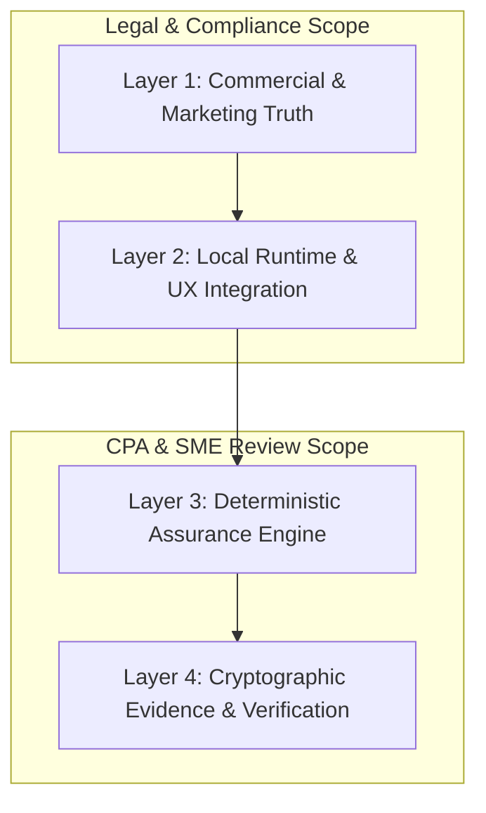

# VaultBasis MMP-1.5: Side-by-Side UAT & CPA/SME Validation Matrix
**Document Version:** 1.5.0-RC3  
**Status:** ACTIVE / UNDER SME REVIEW (CPA/SME REVIEW PENDING)  
**Target Audience:** CPAs, Tax Technology SMEs, Legal/Compliance Reviewers, QA Engineers  
**Governing Standard:** Granite-Grade Left-Shift Industrial Standard (MMP-1.5 Freeze)  
**Normative References:** PRD v26.0, Evidence Contract v0.1, Known Limitations v1.5.0  

---

## 1. Executive Governance & Multi-Round Review Framework

This matrix is the central audit ledger for side-by-side verification of all functional UAT scenarios, non-functional benchmarks, and security observations. It tracks initial execution findings, defects discovered, code remediations, rebuilt artifact identities, and dual-layer verification (engineering automation vs. human CPA UI journey).

### Review Taxonomy & Sign-Off Rules
- **Engineering Evidence:** Tracks automated unit, integration, and API qualification evidence.
- **Internal Adjudication:** Formal engineering judgment based on observed contracts.
- **CPA / Tax SME Sign-Off:** Independent validation by qualified practitioner subject matter experts (**Never pre-checked; defaults to `PENDING`**).
- **Legal / Compliance Sign-Off:** Confirmation of regulatory alignment and commercial scope (**Never pre-checked; defaults to `PENDING`**).

---

## 2. Master Functional UAT Campaign Matrix (UAT-01 to UAT-30)

| Scenario ID | User / CPA Objective | Input Fixture(s) & SHA | Expected Deterministic Outcome | Round 1 Actual & Evidence | Defect Discovered | Remediation Commit & Rebuilt Artifact | Round 2 Actual & Evidence | CPA/SME Review Question | Technical Invariant | Internal Adjudication | CPA/SME Sign-Off | Legal/Compliance Sign-Off | Platform(s) | Final Status |
|---|---|---|---|---|---|---|---|---|---|---|---|---|---|---|
| **UAT-01** | Understand product purpose, boundaries, and engagement scope without developer assistance. | Public Web (`vaultbasis.com`) | Clear distinction between reconciliation evidence and tax prep/legal advice; local-only computation. | Overbroad privacy wording (*"100% private"*) and vague scope. | Inexact marketing claims regarding tax advice and absolute privacy. | Commit `5b3b312` Artifact: Web Static | **UAT-01R2:** Narrowed privacy claims; clear professional boundaries and local edge processing model. | Does the marketing clearly communicate that VaultBasis is a reconciliation tool and not a tax preparation or advisory service? | Static, commit-bound web app; zero cloud computation; explicit Circular 230 boundaries. | **PASS** | `PENDING` | `PENDING` | Web (All) | **PASS — CLOSED** |
| **UAT-02** | Review pricing, evaluation terms, and licensing scope. | Pricing & Trust Pages | 72h / 3-case evaluation with no credit card; single-seat local license tiers. | Overclaimed "Enterprise multi-seat licensing" (unsupported in MMP-1.5). | Enterprise multi-seat scope contradiction. | Commit `5b3b312` Artifact: Web Static | **UAT-02R2:** Removed multi-seat wording; standardized on single-seat local runtime with custom case volumes. | Are commercial terms, evaluation duration, and single-seat local boundaries unambiguous? | Offline license verification; zero cloud telemetry or activation phoning. | **PASS** | `PENDING` | `PENDING` | Web (All) | **PASS — CLOSED** |
| **UAT-03A** | Non-technical macOS installation, double-click launch, GUI dashboard, and clean exit. | `VaultBasis-RC3-macOS-arm64.dmg` | Finder drag-and-drop; GUI launch opens browser; visible Quit control releases port 8000. | Rehearsed via CLI script; lacked authentic user-like GUI interaction. | Insufficient human-path validation in initial test. | Rebuilt DMG: `06fb3624...` | **UAT-03M:** Verified physical Finder double-click, browser auto-launch, UI Quit, socket release, and GUI relaunch. | Can non-technical tax staff install and operate the application without command-line intervention? | PyInstaller bundle binds strictly to `127.0.0.1:8000`; clean SIGTERM signal handler. | **PASS** | `PENDING` | `PENDING` | macOS arm64 | **PASS — CLOSED** |
| **UAT-03B** | Non-technical Windows installation, Explorer launch, GUI dashboard, and clean exit. | `VaultBasis-Setup-1.5.0-rc3.exe` (Pending) | Windows Setup wizard; double-click launch; visible Quit releases port. | *Not run yet.* | Pending native Windows qualification. | In Progress | Waiting for native Windows candidate build. | Does the Windows installer and runtime provide identical non-technical UX? | Windows service/process isolation; localhost binding; clean port release. | **NOT RUN** | `PENDING` | `PENDING` | Windows x64 | **WAITING FOR WIN CANDIDATE** |
| **UAT-04** | Verify authentic bundled sample immutability, factual findings, and cloning workflow. | `CASE-SAMPLE-2025` (5 Broker / 5 Ledger rows) | Sample is immutable reference data; unmetered access; cloning creates production case and consumes 1 slot; neutral finding text. | Allowed note editing and revision 2 on sample; findings contained speculative text (*"fee"*, *"Box B"*). | 1. Sample mutability. 2. Speculative tax wording. 3. "Uncovered Security" terminology. | Commit `d1ef4ca` Rebuilt DMG: `9f1c1433...` | **UAT-04R-A (API):** PASS (403 on sample mutation; clone created; capacity decremented; neutral text). **UAT-04R-B (UI):** PENDING human execution. | Does the software prevent altering vendor reference evidence while allowing full practitioner review on clones? | `CaseWritePolicy.assert_can_mutate` blocks sample edits; deterministic findings contain zero causal hypotheses. | **UAT-04R-A: PASS** UAT-04R-B: PENDING | `PENDING` | `PENDING` | macOS / Windows | **REMEDIATION PASS (UI PENDING)** |
| **UAT-05** | Reconcile identical broker and taxpayer records (Perfect Agreement). | `broker_perfect.csv` `ledger_perfect.csv` (DATA-01) | 100% matched transactions; `FULLY_RECONCILED` outcome state; 0 findings. | *Queued for next execution round.* | N/A | Current Candidate | Scheduled next. | Does the engine confirm exact agreement across proceeds, basis, and dates without false positives? | Exact string/decimal equality across all canonical fields; 0 variance. | **READY** | `PENDING` | `PENDING` | All | **READY** |
| **UAT-06** | Detect and isolate proceeds variance while cost basis matches. | `broker_proceeds_diff.csv` `ledger_proceeds_diff.csv` | Outcome `PROCEEDS_DIFFERENCE`; exact dollar variance displayed; neutral next-step guidance. | *Queued.* | N/A | Current Candidate | Scheduled. | Are proceeds variances isolated without conflating cost basis or inventing fee deductions? | `abs(broker_proceeds - ledger_proceeds) > 0` triggers variance; basis untouched. | **PLANNED** | `PENDING` | `PENDING` | All | **PLANNED** |
| **UAT-07** | Detect and isolate cost basis variance while proceeds match. | `broker_basis_diff.csv` `ledger_basis_diff.csv` | Outcome `BASIS_DIFFERENCE`; exact basis variance displayed; neutral review guidance. | *Queued.* | N/A | Current Candidate | Scheduled. | Does the engine display basis variance without inferring taxpayer lot accounting methods? | `abs(broker_basis - ledger_basis) > 0` triggers variance; proceeds untouched. | **PLANNED** | `PENDING` | `PENDING` | All | **PLANNED** |
| **UAT-08** | Detect simultaneous proceeds and cost basis variances on single transaction. | `broker_dual_diff.csv` `ledger_dual_diff.csv` | Outcome `MATERIAL_DIFFERENCE`; both proceeds and basis discrepancies listed independently. | *Queued.* | N/A | Current Candidate | Scheduled. | Are dual discrepancies surfaced distinctly without arithmetic cross-cancellation? | Independent variance calculation for proceeds and basis on same match pair. | **PLANNED** | `PENDING` | `PENDING` | All | **PLANNED** |
| **UAT-09** | Reconcile records where broker has transaction missing from taxpayer ledger. | `broker_orphan.csv` `ledger_standard.csv` | Outcome `UNRECONCILED_MISSING_LEDGER`; transaction flagged as missing from ledger. | *Queued.* | N/A | Current Candidate | Scheduled. | Does the system clearly distinguish missing records from numeric discrepancies? | Unpaired Source A row marked `MISSING_FROM_LEDGER`; no synthetic pairing. | **PLANNED** | `PENDING` | `PENDING` | All | **PLANNED** |
| **UAT-10** | Reconcile records where taxpayer ledger has transaction missing from broker 1099-DA. | `broker_standard.csv` `ledger_orphan.csv` | Outcome `UNRECONCILED_MISSING_BROKER`; transaction flagged as missing from 1099-DA. | *Queued.* | N/A | Current Candidate | Scheduled. | Are unreported off-broker transactions preserved and highlighted for practitioner review? | Unpaired Source B row marked `MISSING_FROM_BROKER`; no synthetic pairing. | **PLANNED** | `PENDING` | `PENDING` | All | **PLANNED** |
| **UAT-11** | Handle multiple ambiguous transaction candidates with identical dates and assets. | `broker_ambiguous.csv` `ledger_ambiguous.csv` | Fail closed with `AMBIGUOUS_MATCH`; zero arbitrary or silent heuristic matching. | *Queued.* | N/A | Current Candidate | Scheduled. | Does the software refuse to guess lot pairings when multiple identical matches exist? | Ambiguity detection triggers fail-closed `AMBIGUOUS_MATCH` status. | **PLANNED** | `PENDING` | `PENDING` | All | **PLANNED** |
| **UAT-12** | Ingest and reconcile Form 1099-DA with Box 2 = NO (Unreported Basis). | `broker_box2_no.csv` `ledger_standard.csv` | Outcome `REPORTING_SCOPE_DIFFERENCE`; non-classifying label `Basis Not Reported by Broker (Box 2 = NO)`. | *Queued.* | N/A | Current Candidate | Scheduled. | Does the tool avoid classifying digital assets as "securities" while recognizing unreported broker basis? | Box 2 = NO maps to `UNREPORTED_BASIS` without coercing broker basis to `$0.00`. | **PLANNED** | `PENDING` | `PENDING` | All | **PLANNED** |
| **UAT-13** | Ingest and reconcile explicit $0.00 cost basis (e.g. Airdrop / Zero Basis). | `broker_zero_basis.csv` `ledger_zero_basis.csv` | Explicit `$0.00` basis retained as numeric zero, distinct from missing/unreported basis. | *Queued.* | N/A | Current Candidate | Scheduled. | Is true zero basis preserved without being treated as missing or corrupted data? | `basis == Decimal('0.00')` preserved as explicit value with `basis_reported = True`. | **PLANNED** | `PENDING` | `PENDING` | All | **PLANNED** |
| **UAT-14** | Ingest missing basis field in taxpayer ledger. | `broker_standard.csv` `ledger_null_basis.csv` | Blank basis field preserved as `MISSING`; does not coerce to `$0.00`. | *Queued.* | N/A | Current Candidate | Scheduled. | Does the system prevent silent data drift by preserving null basis states? | `None` / empty string retained as null; comparison marks `BASIS_UNAVAILABLE`. | **PLANNED** | `PENDING` | `PENDING` | All | **PLANNED** |
| **UAT-15** | Normalization of equivalent numeric representations across different schemas. | `broker_norm.csv` `ledger_norm.csv` | `1.0` equals `1.00000000`; lexical source precision preserved in provenance view. | *Queued.* | N/A | Current Candidate | Scheduled. | Does numeric comparison handle decimal representation differences while preserving raw text? | Python `Decimal` normalization for comparison; raw lexical strings retained. | **PLANNED** | `PENDING` | `PENDING` | All | **PLANNED** |
| **UAT-16** | Micro-variance detection (sub-dollar / single-cent discrepancies). | `broker_cent_diff.csv` `ledger_cent_diff.csv` | Exact $0.01 variance detected and surfaced; zero floating-point rounding errors. | *Queued.* | N/A | Current Candidate | Scheduled. | Are single-cent variances accurately calculated without being swallowed by tolerance thresholds? | Exact 2-decimal arithmetic; `abs(diff) >= Decimal('0.01')` generates finding. | **PLANNED** | `PENDING` | `PENDING` | All | **PLANNED** |
| **UAT-17** | Intake malformed, corrupted, or unsupported CSV formats. | `corrupted_headers.csv` `invalid_dates.csv` | Fail closed at intake; informative error diagnostic identifying offending rows; zero partial case corruption. | *Queued.* | N/A | Current Candidate | Scheduled. | Does the application cleanly reject corrupted files without crashing or creating zombie cases? | Schema validator fails before case creation; atomic rollback. | **PLANNED** | `PENDING` | `PENDING` | All | **PLANNED** |
| **UAT-18** | Ingest duplicate transaction rows in source documents. | `broker_duplicates.csv` `ledger_standard.csv` | Duplicate rows flagged in intake diagnostic; deterministic pairing or fail-closed ambiguity. | *Queued.* | N/A | Current Candidate | Scheduled. | Does the system detect and alert on duplicated transactions within the same source file? | Row fingerprinting detects duplicate entries and flags for practitioner review. | **PLANNED** | `PENDING` | `PENDING` | All | **PLANNED** |
| **UAT-19** | Intake hostile CSV payloads (Formula injection, XSS strings, oversized fields). | `hostile_payload.csv` | Content sanitized for display and export; formula execution prevented (`=CMD`, `<script>`). | *Queued.* | N/A | Current Candidate | Scheduled. | Are workpapers and exports protected against spreadsheet formula injection and UI script execution? | Text cells sanitized with leading tick prefix for export; HTML entity escaping in UI. | **PLANNED** | `PENDING` | `PENDING` | All | **PLANNED** |
| **UAT-20** | Ingest unsupported tax year (e.g. 2023) or non-US jurisdiction. | `broker_2023.csv` | Rejection at case creation: *"Tax Year 2023 is outside MMP-1.5 scope (Supported: 2025 US)"*. | *Queued.* | N/A | Current Candidate | Scheduled. | Does the system enforce tax year and jurisdictional scope boundaries at intake? | Intake policy asserts `tax_year == 2025` and `jurisdiction == 'US'`. | **PLANNED** | `PENDING` | `PENDING` | All | **PLANNED** |
| **UAT-21** | Comprehensive mixed realistic case (Agreements + Proceeds Diff + Basis Diff + Unreported Basis + Missing Rows). | `broker_realistic.csv` `ledger_realistic.csv` | Comprehensive finding breakdown; summary statistics match component sums exactly. | *Queued.* | N/A | Current Candidate | Scheduled. | Does the engine handle realistic client cases with multiple concurrent discrepancy types accurately? | Independent evaluation per transaction; holistic receipt outcome aggregation. | **PLANNED** | `PENDING` | `PENDING` | All | **PLANNED** |
| **UAT-22** | Practitioner review workflow on cloned case (Dispositions, notes, and finalization). | Cloned Production Case | Practitioner notes saved; dispositions updated; deterministic engine facts remain unmodified. | *Queued.* | N/A | Current Candidate | Scheduled. | Does practitioner review augment findings with notes without altering underlying factual comparisons? | Audit trail records practitioner review entries in separate metadata table; facts immutable. | **PLANNED** | `PENDING` | `PENDING` | All | **PLANNED** |
| **UAT-23** | Distinguish preliminary reconciliation receipt (Rev 1) from reviewed receipt (Rev 2). | Preliminary vs Final Case State | Preliminary receipt marked `UNREVIEWED`; finalized receipt marked `REVIEWED_ANNOTATED` with revision counter incremented. | *Queued.* | N/A | Current Candidate | Scheduled. | Are draft workpapers clearly distinguishable from finalized practitioner workpapers? | Receipt schema enforces `human_review_state` enum and monotonically increasing `revision`. | **PLANNED** | `PENDING` | `PENDING` | All | **PLANNED** |
| **UAT-24** | Standalone offline receipt verification and tamper detection. | `reconciliation_receipt.json` | Authentic receipt verifies `VALID`; bit-flipped or modified receipt verifies `INVALID`. | Validated in UAT-04 baseline and verified in UAT-04R. | N/A | Current Candidate | Verified in UAT-04R rehearsal. | Can an auditor verify receipt authenticity offline without VaultBasis software or database access? | Standalone Ed25519 cryptographic signature verification against canonical JSON payload. | **PASS (Sample Rehearsal)** | `PENDING` | `PENDING` | All | **PASS (Rehearsal)** |
| **UAT-25** | Evaluation capacity boundaries and monotonic consumption. | Evaluation License | 3 cases created successfully; 4th case creation blocked with clear upgrade prompt. | *Queued.* | N/A | Current Candidate | Scheduled. | Does the evaluation tier strictly enforce the 3-case limit without data loss on existing cases? | SQLite atomic transaction increments `cases_created_count`; blocks at limit. | **PLANNED** | `PENDING` | `PENDING` | All | **PLANNED** |
| **UAT-26** | Commercial license validation and expired/malformed token handling. | Valid / Expired / Corrupted Tokens | Valid token unlocks capacity; expired/corrupt tokens fail closed with actionable error. | *Queued.* | N/A | Current Candidate | Scheduled. | Is license enforcement deterministic and tamper-resistant in air-gapped environments? | Ed25519 signed license tokens with expiry and capacity claims; zero phoning. | **PLANNED** | `PENDING` | `PENDING` | All | **PLANNED** |
| **UAT-27** | Persistence, crash recovery, and clean restart. | In-Progress Case | Application restart restores exact case state, findings, practitioner notes, and receipt revision. | *Queued.* | N/A | Current Candidate | Scheduled. | Does the local database survive unexpected process termination without data corruption? | SQLite WAL mode with ACID transactions; automatic schema integrity check on boot. | **PLANNED** | `PENDING` | `PENDING` | All | **PLANNED** |
| **UAT-28** | Complete air-gapped offline journey without network connectivity. | Network interface disabled (`ifconfig down`) | Full lifecycle (Intake -> Reconcile -> Review -> Export -> Verify) succeeds with zero network. | *Queued.* | N/A | Current Candidate | Scheduled. | Can a CPA operate the entire software in a secure, air-gapped clean room? | Zero external CDN/font/API dependencies; all assets bundled locally in binary. | **PLANNED** | `PENDING` | `PENDING` | All | **PLANNED** |
| **UAT-29** | End-to-end CPA "Golden Journey" (Discovery to Final Audit Package). | Full Client Lifecycle | Smooth, unassisted workflow across all product surfaces from initial install to audit defense package. | *Queued.* | N/A | Current Candidate | Scheduled. | Does the cohesive product experience satisfy practitioner standards for audit defense readiness? | Full integration across commercial, engine, UX, and cryptographic receipt layers. | **PLANNED** | `PENDING` | `PENDING` | All | **PLANNED** |
| **UAT-30** | Cross-platform deterministic parity (macOS arm64 vs Windows x64). | Identical Fixtures on macOS & Windows | Bit-for-bit identical reconciliation outputs, variance amounts, and receipt digests. | *Queued.* | N/A | Current Candidates | Scheduled upon Windows build. | Does the software produce identical results regardless of host operating system? | Platform-independent decimal math, sorted JSON serialization, and canonical line endings. | **PLANNED** | `PENDING` | `PENDING` | macOS / Windows | **PLANNED** |

---

## 3. Dedicated Non-Functional, Security & Platform Qualification Tracks

To maintain clear boundaries between CPA functional acceptance and technical systems engineering, non-functional validations are maintained in separate qualification tracks:

### Performance & Scalability Benchmark Track (`PERF`)
| Track ID | Scenario Description | Target Workload | SLA / Acceptance Criteria | Status |
|---|---|---|---|---|
| **PERF-01** | High-Volume Ingestion & Reconciliation Benchmark | 10,000 Broker rows vs. 10,000 Ledger rows | Reconciles correctly without UI freeze, process crash, memory exhaustion, or decimal precision loss. (*Provisional performance benchmark; baseline to be recorded*). | **READY** |

### Security & Privacy Observation Track (`SEC`)
| Track ID | Scenario Description | Observation Method | Acceptance Criteria | Status |
|---|---|---|---|---|
| **SEC-01** | Process-Aware Network Egress Audit | OS packet trace (`tcpdump`, Wireshark, `lsof`) during full reconciliation & export lifecycle | No unexpected VaultBasis-owned outbound network traffic from the VaultBasis process tree during defined workflows. Client case files are not uploaded to cloud services. | **PASS (Candidate)** |
| **SEC-02** | Local Filesystem & Key Permissions | OS permission inspection (`stat` / ACLs) on `data/keys/` and database files | Unix/macOS: Private keys restricted to POSIX `0600`. Windows: Private keys restricted to current user security identifier (ACL). | **PASS (Candidate)** |
| **SEC-03** | Hostile Parser & Memory Fuzzing | Malformed, oversized, and recursive CSV inputs | Fail closed cleanly with intake diagnostics; zero unhandled segmentation faults or buffer overflows. | **PASS (Automated)** |

### Platform Installation & OS Integration Track (`PLAT`)
| Track ID | Scenario Description | Environment | Acceptance Criteria | Status |
|---|---|---|---|---|
| **PLAT-MAC-01** | macOS Native Application Bundle Lifecycle | macOS 14/15 Apple Silicon | Clean `.dmg` mount, drag to `/Applications`, double-click launch, GUI Quit, clean port release. | **PASS — CLOSED** |
| **PLAT-WIN-01** | Windows Native Installer & Runtime Lifecycle | Windows 11 x64 (Clean VM) | Clean Setup wizard install, desktop shortcut launch, visible GUI controls, clean exit and uninstall. | **WAITING FOR CANDIDATE** |

---

## 4. Formal Reviewer Sign-Off Ledger

> **Governance Notice:** This sign-off ledger is active and open. Formal signatures must only be recorded after named practitioners, legal reviewers, and technical leads inspect the corresponding execution evidence.

| Validation Domain | Reviewing Stakeholder | Organization / Role | Review Date | Formal Determination | Signature / Attestation |
|---|---|---|---|---|---|
| **Technical & Industrial Gates** | Engineering Lead | VaultBasis Core Team | 2026-10-08 | `PASS` (Candidate 9f1c1433...) | *[Recorded in CI / Pre-Sign Logs]* |
| **CPA Functional Workflow** | External Tax SME / CPA | Independent Practice Reviewer | *Pending* | `PENDING REVIEW` | *[Pending Formal Review]* |
| **Regulatory & Tax Boundary** | Tax Controversy Advisor | SME Advisory Group | *Pending* | `PENDING REVIEW` | *[Pending Formal Review]* |
| **Legal & Privacy Scope** | Compliance Counsel | Legal & Regulatory Review | *Pending* | `PENDING REVIEW` | *[Pending Formal Review]* |

---

## 5. Next Immediate Operational Step
With the validation matrix fully rebased and corrected:
1. Scenario **`UAT-05 — Perfect Agreement (DATA-01)`** is ready for execution.
2. High-volume stress testing is established as **`PERF-01`** and will be benchmarked alongside the functional campaign.
