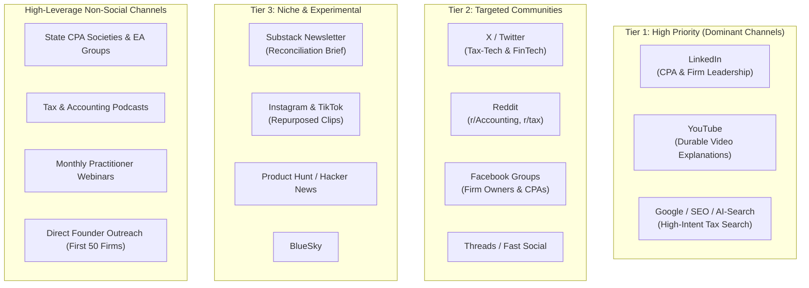

# MMP15-GTM-LAUNCH-001: VaultBasis Commercial Launch & Market Entry Program
**Program ID:** MMP15-GTM-LAUNCH-001  
**Document Version:** 1.0.0-PROD  
**Governing Standard:** Granite-Grade Left-Shift Industrial Standard  
**Scope:** Commercial Launch, GTM Operations, Content Asset Bank, Distribution Channels, and ICP Acquisition  
**Target Milestone:** Dual-Track Commercial Execution (Running Parallel to UAT-26 onward through Signed Release)  
**Effective Date:** 2026-10-09  

---

## 1. Executive Charter & Strategic Intent

The engineering core of VaultBasis is deterministically verified. However, an enterprise-grade product without a disciplined, first-class Go-To-Market (GTM) program cannot achieve commercial success.

This program defines the commercial launch engine for VaultBasis MMP-1.5. It operates **in parallel** with the technical signing and qualification track, ensuring that when the final executables are signed and notarized, the market positioning, content assets, distribution channels, and practitioner intake funnels are fully primed for immediate customer onboarding.

```text
                                  DUAL-TRACK LAUNCH EXECUTION
┌─────────────────────────────────────────────────────────┐   ┌─────────────────────────────────────────────────────────┐
│              TRACK 1: TECHNICAL QUALIFICATION           │   │                TRACK 2: GTM & COMMERCIAL LAUNCH         │
│  • UAT-26..29 (Commercial, Resilience, Air-Gap, CPA)    │   │  • Positioning & Category Freeze                        │
│  • Windows Candidate & Cross-Platform Parity (UAT-30)   │   │  • Primary ICP Targeting & Direct Founder Outreach      │
│  • SEC-01..03, PERF-01, PLAT-MAC/WIN Qualification      │   │  • Multi-Tier Channel Stack (LinkedIn, YouTube, Search) │
│  • macOS Notarization & Windows Authenticode Signing    │   │  • Educational Content Asset Bank & AI-Search SEO       │
│  • Final Signed Artifact Qualification & Gates 01..18   │   │  • 10-to-1 Content Multiplier Engine                    │
└────────────────────────────┬────────────────────────────┘   └────────────────────────────┬────────────────────────────┘
                             │                                                             │
                             ▼                                                             ▼
             ┌─────────────────────────────────────────────────────────────────────────────────────────────┐
             │               COMMERCIAL ACTIVATION: DISTRIBUTION_ACTIVE (PROD-GATE-18)                     │
             │   Exact Signed Binaries + Primed Market Channels + 5–8 CPA Pilot Onboarding (CPA-001..010)   │
             └─────────────────────────────────────────────────────────────────────────────────────────────┘
```

---

## 2. Category & Positioning Freeze

To prevent message fragmentation across web, social, email, PR, and direct sales, VaultBasis establishes a frozen commercial positioning foundation:

### A. Product Category
**Digital Asset Reconciliation & Evidence**

### B. Hero Headline
> **Reconcile Form 1099-DA against your client's crypto tax records.**

### C. Core Supporting Value Proposition
> **See what agrees, what differs, and what still needs professional review—then preserve a verifiable record of the work.**

### D. Primary Buying Motivation vs. Trust Differentiators

```
┌───────────────────────────────────────────────────────────────────────────────────────────────────────┐
│                                   PRIMARY BUYING REASON (The Problem)                                 │
│  1. Unmanageable Form 1099-DA review workload during filing season.                                  │
│  2. High uncertainty between broker 1099-DA figures vs. client transaction ledgers.                   │
│  3. Absence of an audit-ready, tamper-evident record preserving reconciliation workpapers.            │
│  4. Need for a defensible, standardized professional review workflow.                                 │
├───────────────────────────────────────────────────────────────────────────────────────────────────────┤
│                                  TRUST DIFFERENTIATORS (The Proof)                                    │
│  • Local-First Edge Execution: Client tax records and ledger CSVs never touch third-party clouds.     │
│  • Independent Cryptographic Receipts: Standalone verification with zero runtime or account dependency│
│  • Deterministic Engine: Zero AI hallucination; exact decimal arithmetic; immutable review lineage.   │
└───────────────────────────────────────────────────────────────────────────────────────────────────────┘
```

---

## 3. Ideal Customer Profile (ICP) Taxonomy

Launch resources and marketing spend are focused strictly on high-intent tax accounting professionals. Retail consumer marketing is explicitly excluded.

```
┌─────────────────────────────────────────────────────────────────────────────────────────────────────────┐
│                                       PRIMARY TARGET AUDIENCE (ICP)                                     │
│  • Licensed CPAs (Certified Public Accountants) with crypto / digital asset client engagements          │
│  • Enrolled Agents (EAs) preparing Form 1040 Schedule D and Form 8949 filings                           │
│  • Tax Partners & Practice Leaders at small to mid-sized accounting firms (5–50 staff)                 │
│  • Digital Asset Tax Specialists & Specialized Crypto Accounting Practices                              │
│  • Tax Technology Leaders & Managing Directors inside Top 100 accounting firms                          │
├─────────────────────────────────────────────────────────────────────────────────────────────────────────┤
│                                         SECONDARY AUDIENCE                                              │
│  • Accounting Firm IT & Security Reviewers (validating air-gap and local data boundary compliance)      │
│  • Tax Operations Managers (streamlining review workflows and junior staff review consistency)          │
│  • Forensic Accountants & Digital Asset Litigation Support Specialists                                  │
├─────────────────────────────────────────────────────────────────────────────────────────────────────────┤
│                                      EXCLUDED AUDIENCE (NON-TARGET)                                     │
│  • Retail cryptocurrency investors seeking generic tax filing wizards                                  │
│  • High-frequency day traders seeking automated tax loss harvesting bots                                │
│  • General consumers with simple single-broker accounts requiring no reconciliation                     │
└─────────────────────────────────────────────────────────────────────────────────────────────────────────┘
```

---

## 4. Multi-Tier Channel Distribution Strategy

Channels are prioritized by practitioner density, purchasing intent, and durable organic discovery.



### Tier 1 — High-Priority Channels (Dominant Focus)
1. **LinkedIn:** Primary channel for B2B accounting practice engagement.
   - Founder thought leadership and technical deep-dives on Form 1099-DA reconciliation.
   - Side-by-side workflow demonstrations (Broker CSV vs. Client Ledger vs. Evidence Receipt).
   - Firm IT/security trust briefs (local-first data boundary, air-gap architecture).
   - Design partner testimonials and CPA pain-point teardowns.
2. **YouTube:** Durable video repository driving long-tail search and AI answer citation.
   - *Video 01:* "What Form 1099-DA Means for CPAs in 2025" (7 min).
   - *Video 02:* "How to Reconcile Broker Reporting Against Client Ledgers" (10 min).
   - *Video 03:* "What Box 2 = NO Actually Means in Practice" (5 min).
   - *Video 04:* "Missing Basis vs. Zero Basis vs. Unreported Basis: The Differences" (6 min).
   - *Video 05:* "How VaultBasis Evidence Receipts Work (Ed25519 Cryptography for Tax Staff)" (8 min).
   - *Video 06:* "Standalone Offline Verifier Demo in an Air-Gapped Environment" (5 min).
   - *Video 07:* "Complete CPA Golden Journey Workflow" (12 min).
3. **Google / SEO & Answer Engines:** High-intent search capture for technical regulatory queries.

### Tier 2 — Targeted Ecosystem Channels
1. **X (Twitter):** Tax technology commentary, regulatory updates, product release notes, and technical receipts evidence.
2. **Reddit (`r/Accounting`, `r/tax`, `r/CryptoTax`):** High-substance technical participation answering complex 1099-DA basis questions; zero promotional spam.
3. **Facebook:** Specialized CPA and accounting firm owner peer groups.
4. **Threads:** Selective syndication of founder insights.

### Tier 3 — Secondary & Experimental Channels
1. **Substack / Email Newsletter:** *"The Digital Asset Reconciliation Brief for Tax Professionals"* — an owned publication establishing long-term practitioner mindshare.
2. **Instagram & TikTok:** Repurposed visual assets (workflow carousels, 60-second explainer clips).
3. **Product Hunt & Hacker News:** Awareness and architectural discussions regarding local-first verifiable computing.
4. **BlueSky:** Reserved handle and syndicated technical updates.

---

## 5. High-Leverage Non-Social Acquisition Channels

For accounting software, non-social institutional channels generate significantly higher conversion rates:

```text
1. CPA & EA PROFESSIONAL ASSOCIATIONS
   • Pitch educational sessions to State CPA Societies (e.g., CalCPA, NYSSCPA, TXCPA).
   • Engage National Association of Enrolled Agents (NAEA) local chapters.
   • Offer technical continuing education (CPE) content on 1099-DA compliance.

2. TAX & ACCOUNTING PODCASTS
   • Pitch guest appearances on prominent shows (e.g., Accounting Today, Cloud Accounting Podcast,
     The Modern CPA Success Show, Crypto Tax Decoded).
   • Topic Angle: "What reconciliation looks like when Form 1099-DA and client crypto records disagree."

3. MONTHLY PRACTITIONER WEBINARS
   • Host a recurring monthly deep-dive: "How to Reconcile Form 1099-DA Without Treating Broker Data as Tax Truth."
   • Live product demonstration and interactive Q&A.

4. DIRECT FOUNDER OUTREACH (First 50 Firms)
   • 1-on-1 personalized outreach from the founder to 100 selected digital-asset CPA practices.
   • Offer hands-on white-glove onboarding for their complex 2025 pilot cases.
```

---

## 6. Launch Content Asset Inventory Bank

All core launch assets must be authored and frozen prior to public release:

```
├── Product Demo & Technical Assets
│   ├── [ASSET-01] 90-Second Product Overview Video
│   ├── [ASSET-02] 5-Minute CPA Quick-Start Walkthrough Video
│   ├── [ASSET-03] 10-Minute Full Case Lifecycle & Evidence Package Demo
│   ├── [ASSET-04] IT & Security Architecture Whitepaper (Air-Gap & Posix Permissions)
│   ├── [ASSET-05] Standalone Verifier Guide & CLI Walkthrough
│   ├── [ASSET-06] Downloadable Authentic Evidence Package Sample (.zip + .json + .csv)
│   └── [ASSET-07] Cryptographic SHA-256 Download Verification Sheet
│
├── Educational Regulatory Articles (SEO & Answer-Engine Core)
│   ├── [ART-01] "What is Form 1099-DA? A Practical Guide for Tax Practitioners"
│   ├── [ART-02] "How CPAs Should Reconcile Form 1099-DA Against Taxpayer Ledgers"
│   ├── [ART-03] "Form 1099-DA vs. Client Crypto Records: Why They Differ"
│   ├── [ART-04] "Understanding Box 2 = NO: Handling Unreported Cost Basis"
│   ├── [ART-05] "Basis Not Reported vs. Missing Basis vs. Explicit Zero Basis"
│   ├── [ART-06] "How to Document Digital Asset Reconciliation for Tax Defense"
│   ├── [ART-07] "What an Evidence Receipt Proves — And What It Does Not Prove"
│   └── [ART-08] "Preserving Multi-Year Audit Trails in Cryptocurrency Engagements"
│
└── Commercial & Trust Operations Collateral
    ├── [DOC-01] Commercial Pricing & Capacity Guide (Practitioner vs. Firm)
    ├── [DOC-02] Trust Center, Security Architecture & Subprocessor Register
    ├── [DOC-03] Privacy Policy & Local Data Boundary Guarantee
    ├── [DOC-04] Terms of Service & Commercial Evaluation Policy
    ├── [DOC-05] Release Notes v1.5.0-RC3 & Known Limitations Schedule
    └── [DOC-06] Practitioner Support Escalation & Contact SLA Sheet
```

---

## 7. AI-Search & Answer-Engine Optimization (AEO)

Modern discovery requires direct indexing by AI search engines (ChatGPT Search, Perplexity, Google AI Overviews, Claude, Gemini):

1. **Structured Data Implementation:**
   - `SoftwareApplication` JSON-LD schema declaring local execution, operating systems, and cryptographic verifiability.
   - `FAQPage` schema on documentation and pricing pages with exact, unambiguous answers.
   - `Organization` schema with verified contact and security disclosure endpoints.
2. **Authoritative, Factual Terminology:**
   - Strict avoidance of generic AI buzzwords (*"revolutionary"*, *"seamless"*, *"turnkey"*).
   - Clear declarative definitions of regulatory concepts (Form 1099-DA Box 2, non-deductible variances, gross proceeds isolation).
3. **Indexable Technical Specifications:**
   - Publicly accessible receipt specification (`schemas/receipt/verification-v0.1.md`).
   - Clear markdown documentation with consistent headings, timestamps, and authorship.

---

## 8. 10-to-1 Content Multiplier Engine

To maintain high output without administrative overhead, every piece of primary research is systematically repurposed into 10 distinct distribution assets:

```text
┌────────────────────────────────────────────────────────────────────────────────────────────────────────┐
│                        PRIMARY ASSET: 10-Minute Deep-Dive YouTube Technical Video                      │
└───────────────────────────────────────────────────┬────────────────────────────────────────────────────┘
                                                    │
         ┌──────────────────────────────────────────┼──────────────────────────────────────────┐
         ▼                                          ▼                                          ▼
┌──────────────────┐                       ┌──────────────────┐                       ┌──────────────────┐
│  LinkedIn Long   │                       │ 3x LinkedIn Short│                       │ 8-Post X Thread  │
│  Case Breakdown  │                       │ Practical Posts  │                       │ Key Findings     │
└────────┬─────────┘                       └────────┬─────────┘                       └────────┬─────────┘
         │                                          │                                          │
         ├──────────────────────────────────────────┼──────────────────────────────────────────┤
         ▼                                          ▼                                          ▼
┌──────────────────┐                       ┌──────────────────┐                       ┌──────────────────┐
│ Instagram 7-Slide│                       │ 2x YouTube Shorts│                       │ Substack Section │
│ Workflow Carousel│                       │ Under 60s Clips  │                       │ Deep-Dive Brief  │
└────────┬─────────┘                       └────────┬─────────┘                       └────────┬─────────┘
         │                                          │                                          │
         └──────────────────────────────────────────┼──────────────────────────────────────────┘
                                                    ▼
                                   ┌──────────────────────────────────┐
                                   │  Website SEO Article & Guide     │
                                   │  Indexable Knowledgebase Entry   │
                                   └──────────────────────────────────┘
```

---

## 9. 5-Phase Commercial Launch Rollout

```
PHASE 0: AUDIENCE & FOUNDATION BUILDING (Now through Signed Baseline)
├── Publish technical educational articles on Form 1099-DA challenges.
├── Engage initial 10 design-partner accounting practices under NDA/feedback agreement.
├── Verify local privacy architecture and publish Subprocessor Register.
└── Complete internal UAT-26..28 qualification on Candidate 7.

PHASE 1: PRE-LAUNCH ACCESS & PILOT INTAKE (2–4 Weeks Before Release)
├── Launch public landing page with interactive sample case demo.
├── Open qualified CPA evaluation request intake on vaultbasis.com.
├── Publish the 5 core YouTube explainer videos and educational asset bank.
└── Schedule 1-on-1 walkthroughs with 15 target firm leaders.

PHASE 2: LAUNCH WEEK COORDINATION (Release Manifest Frozen)
├── Activate production Paddle checkout, transactional mailer, and download auth.
├── Coordinated release announcement across LinkedIn, YouTube, X, and Substack.
├── Publish official v1.5.0 release notes, standalone verifier, and SHA-256 manifests.
└── Direct outreach to State CPA Society contacts and accounting podcast hosts.

PHASE 3: FIRST 30 DAYS — PILOT SUCCESS & MONETIZATION (CPA-001..010)
├── Focus on unassisted onboarding of first 10 paying CPA/EA firms (CPA-001 through CPA-010).
├── Monitor support queries and time-to-first-reconciliation metrics.
├── Resolve practitioner friction points and refine review documentation.
└── Publish first anonymized practitioner workflow case study.

PHASE 4: 30–90 DAYS — SCALE & INSTITUTIONAL PARTNERSHIPS
├── Host monthly live 1099-DA reconciliation webinars.
├── Expand direct founder outreach to top 100 regional digital-asset tax practices.
├── Evaluate selective high-intent Google Search advertising.
└── Plan state CPA society conference participation and CPE course integration.
```

---

## 10. Paid Acquisition Policy

1. **Zero Premature Ad Spend:** No broad social ad campaigns (Meta, X Ads, generic LinkedIn ads) during Phase 0–2.
2. **Selective Search Only:** In Phase 4, ad spend is restricted strictly to exact-match high-intent Google Search queries (e.g., *"Form 1099-DA reconciliation software"*, *"crypto 1099-DA cost basis software for CPAs"*).
3. **CAC Guardrail:** Customer Acquisition Cost (CAC) must remain below 25% of annual contract value (ACV).

---

## 11. Full-Funnel Measurement Framework

```text
IMPRESSION / DISCOVERY (LinkedIn, YouTube, Search)
       │
       ▼
QUALIFIED SITE VISIT (Practitioner lands on vaultbasis.com)
       │
       ▼
ENGAGEMENT (Inspects interactive sample case / reviews trust center)
       │
       ▼
EVALUATION START (Activates 72-hour / 3-case evaluation)
       │
       ▼
FIRST CASE RECONCILIATION (Uploads Form 1099-DA & Client Ledger)
       │
       ▼
EVIDENCE FINALIZATION (Applies CPA annotations & exports signed receipt)
       │
       ▼
INDEPENDENT VERIFICATION (Runs offline verifier to inspect integrity)
       │
       ▼
COMMERCIAL PURCHASE (Upgrades to Practitioner or Firm Tier via Paddle)
       │
       ▼
ENGAGEMENT RETENTION (Reconciles 10+ client cases; renews annual subscription)
```

### Key Performance Indicators (KPIs)
- **Evaluation Activation Rate:** ≥ 35% of qualified tax practitioner visitors.
- **Time to First Useful Reconciliation:** ≤ 5 minutes from launch to preliminary findings.
- **Evidence Finalization Rate:** ≥ 70% of evaluation cases reach reviewed receipt export.
- **Evaluation-to-Paid Conversion:** ≥ 20% of qualified evaluations converting to Practitioner or Firm plans.
- **Support Burden:** ≤ 0.1 support tickets per evaluated case.

---

## 12. Early Practitioner Feedback Ledger Schema

Every interaction with an early CPA/EA evaluator is recorded in the structured feedback ledger:

```json
{
  "practitioner_id": "CPA-001",
  "organization_type": "Regional Accounting Firm (12 CPAs)",
  "practice_focus": "High Net Worth Digital Asset Filers",
  "client_case_volume_annual": 45,
  "evaluated_fixture_type": "Coinbase Form 1099-DA vs. Koinly Ledger",
  "time_to_first_finding_minutes": 3.5,
  "observed_friction_points": [
    "Practitioner initially looked for a cloud login before realizing it ran locally."
  ],
  "feature_requests": [
    "Multi-year lot matching (MMP-2 scope)"
  ],
  "security_objections": "None (Firm IT approved local-only data boundary)",
  "disposition_classification": "COMMON_FRICTION",
  "commercial_conversion": "CONVERTED_PRACTITIONER_TIER"
}
```

Feedback items are strictly classified into five operational buckets:
1. `BLOCKER`: Prevents engagement completion (must fix before launch).
2. `COMMON_FRICTION`: Workflow confusion resolvable via UI copy or documentation.
3. `NICE_TO_HAVE`: Non-critical usability refinement.
4. `OUT_OF_SCOPE`: Contradicts local deterministic architecture.
5. `MMP-2+`: Multi-year, multi-reviewer, or firm-scale features scheduled for future releases.

---

## 13. Commercial & Legal Claim Hygiene

To protect professional credibility and regulatory compliance, all marketing, sales, and web copy must strictly adhere to the Claim Hygiene Standard:

| Prohibited / Banned Marketing Claims | Approved Factual Statements |
|---|---|
| ❌ *"100% Secure / Zero Vulnerabilities"* | ✅ *"Processes client records locally in an air-gapped architecture with POSIX 0600 filesystem permissions."* |
| ❌ *"IRS Approved / IRS Certified"* | ✅ *"Reconciles Form 1099-DA according to IRS published draft specifications under approved rule packs."* |
| ❌ *"Guarantees Accurate Taxes / Audit Proof"* | ✅ *"Provides deterministic mathematical reconciliation and cryptographic evidence workpapers for tax professional review."* |
| ❌ *"Automated AI Crypto Tax Preparation"* | ✅ *"Deterministic reconciliation engine with zero AI hallucination; preserves raw data fidelity without guessing lot pairings."* |
| ❌ *"Never Sends Any Data Anywhere (Under Any Circumstance)"* | ✅ *"VaultBasis Edge processes client reconciliation and evidence locally on your workstation. Client tax records and ledger data are not uploaded to VaultBasis cloud services for normal Edge case processing."* |
| ❌ *"Verified Receipts Guarantee Tax Correctness"* | ✅ *"Receipt verification confirms cryptographic integrity, schema validity, and source file binding; it does not determine legal or tax correctness."* |

---

## 14. Integrated Master Execution Program (Tracks A through N)

```text
A. PRODUCT QUALIFICATION
   • UAT-26 Commercial Licensing [PASS]
   • UAT-27 Persistence & Crash Recovery [PASS]
   • UAT-28 Air-Gapped Complete Journey [PASS]
   • UAT-29 Full CPA Golden Journey [In Progress]
   • UAT-22 Human Review Layer [Folded into UAT-29]

B. CROSS-PLATFORM PARITY
   • Windows Candidate Build (VaultBasis-Setup-1.5.0-rc3.exe)
   • PLAT-WIN-01 (Windows Native Lifecycle)
   • PLAT-MAC-01 (macOS Native Lifecycle) [PASS]
   • UAT-30 (macOS ↔ Windows Deterministic Parity)

C. PRE-SIGN SECURITY & PERFORMANCE
   • PERF-01 (10,000-Row Benchmark Baseline)
   • SEC-01 (Process-Aware Egress Capture)
   • SEC-02 (Local Filesystem & Key Permissions)
   • SEC-03 (Hostile Parser & Resource Fuzzing)
   • Complete MMP15-SEC-QUAL-001

D. SUBPROCESSOR & OPERATIONS READINESS (MMP15-LAUNCH-OPS-001)
   • Paddle Production Account & Webhook Activation
   • Vercel Edge Hosting & Security Headers
   • Transactional Mailer SPF/DKIM/DMARC Delivery Qualification
   • DNS Security & Registrar MFA Lockdown
   • Vendor DPA & Privacy Register Synchronization

E. COMMERCIAL INFRASTRUCTURE
   • Checkout Webhook Handler (api/webhook-payment.js)
   • Air-Gapped License Generation Ceremony
   • Transactional Email Delivery Templates
   • Clickwrap Terms & Privacy Policy Binding
   • Support & Refund SLA Pathways

F. GTM FOUNDATION (MMP15-GTM-LAUNCH-001)
   • Frozen Positioning & Value Proposition
   • Primary ICP Definition (CPAs & EAs)
   • Public Pricing & Capacity Transparency
   • AI-Search (AEO) Schema Markup

G. LAUNCH CONTENT INVENTORY
   • Demo Video Suite (90s, 5m, 10m)
   • IT & Security Architecture Whitepaper
   • Standalone Verifier Guide & Sample Evidence Package
   • 8 Educational Regulatory Articles

H. MULTI-TIER DISTRIBUTION
   • Tier 1: LinkedIn, YouTube, Google Search
   • Tier 2: X, Reddit, Facebook CPA Groups, Threads
   • Tier 3: Substack Newsletter, Product Hunt, Instagram Clips
   • Institutional: State CPA Societies, Accounting Podcasts, Monthly Webinars
   • Direct Outreach: First 50 Target Accounting Practices

I. PRODUCTION CODE SIGNING
   • Apple Developer ID Application Signing + Hardened Runtime + Notarization + Stapling
   • Windows Microsoft Artifact Signing / Authenticode + RFC 3161 Timestamping

J. FINAL SIGNED ARTIFACT REQUALIFICATION
   • Clean Machine & Managed Endpoint Installation
   • Re-verification of Exact Signed Binaries against Full UAT Matrix

K. HUMAN PRACTITIONER VALIDATION
   • 5–8 Unassisted CPA/EA Qualification Sessions
   • CPA-001 through CPA-010 Customer Progression

L. RELEASE GOVERNANCE & GATES CLOSURE
   • Freeze release-manifest.json with Immutable SHA-256 Hashes
   • Formally Close Canonical Production Gates PROD-GATE-01..18
   • Final Owner Sign-Off Ceremony

M. LAUNCH ACTIVATION
   • Set DISTRIBUTION_ACTIVE = true
   • Execute Coordinated Multi-Channel Announcement
   • Activate Direct Outreach Engine

N. POST-LAUNCH OPERATIONS
   • Daily Support & Friction Monitoring
   • Structured Feedback Ledger Maintenance
   • Case Study Publication & Referral Loop
   • Only After Launch: Authorize MMP-2 Architecture
```
