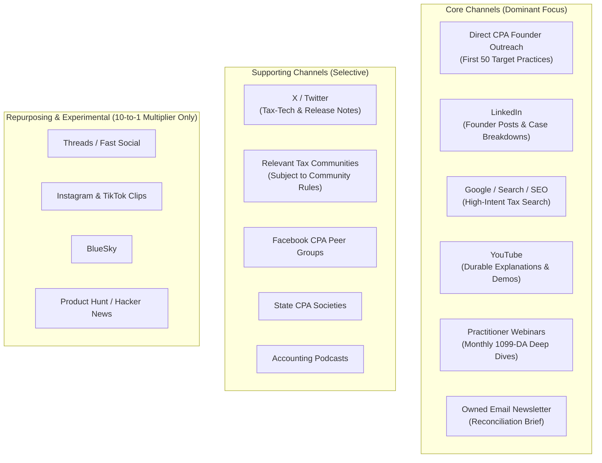

# MMP15-GTM-LAUNCH-001: VaultBasis Commercial Launch & Market Entry Program
**Program ID:** MMP15-GTM-LAUNCH-001  
**Document Version:** 1.1.0-PROD  
**Governing Standard:** Granite-Grade Left-Shift Industrial Standard  
**Scope:** Commercial Launch, GTM Operations, Content Asset Bank, Distribution Channels, and ICP Acquisition  
**Target Milestone:** Dual-Track Commercial Execution (Running Parallel to Technical Qualification)  
**Effective Date:** 2026-10-09  

---

## 1. Executive Charter & Dual-Track Execution

The engineering core of VaultBasis is deterministically verified. However, an enterprise-grade product without a disciplined, first-class Go-To-Market (GTM) program cannot achieve commercial validation.

This program defines the commercial launch engine for VaultBasis MMP-1.5. It operates **in parallel** with the technical signing and qualification track, ensuring that when the final executables are signed and notarized, the market positioning, content assets, distribution channels, and practitioner intake funnels are fully primed for immediate customer onboarding.

```text
                                  DUAL-TRACK LAUNCH EXECUTION
┌─────────────────────────────────────────────────────────┐   ┌─────────────────────────────────────────────────────────┐
│              TRACK 1: TECHNICAL QUALIFICATION           │   │                TRACK 2: GTM & COMMERCIAL LAUNCH         │
│  • UAT-26..28 (Commercial, Resilience, Air-Gap) [PASS]  │   │  • Positioning & Category Freeze                        │
│  • Windows Candidate & Cross-Platform Parity (UAT-30)   │   │  • External Provider / Privacy / Operational Readiness  │
│  • SEC-01..03, PERF-01, PLAT-MAC/WIN Qualification      │   │  • Primary ICP Targeting & Direct Founder Outreach      │
│  • Pre-Sign UAT-29 (Practitioner Workflow Validation)   │   │  • Multi-Tier Channel Stack (Core vs Supporting)        │
│  • macOS Notarization & Windows Authenticode Signing    │   │  • GA_CONTENT_MINIMUM Surfaces & Educational SEO        │
│  • Post-Sign Physical UAT (5–8 CPAs on Signed Bytes)    │   │  • 10-to-1 Content Multiplier Engine                    │
│  • Final Signed Artifact Qualification & Gates 01..18   │   │  • Account Readiness & Initial Market Signal Capture    │
└────────────────────────────┬────────────────────────────┘   └────────────────────────────┬────────────────────────────┘
                             │                                                             │
                             ▼                                                             ▼
             ┌─────────────────────────────────────────────────────────────────────────────────────────────┐
             │               COMMERCIAL ACTIVATION: DISTRIBUTION_ACTIVE (PROD-GATE-18)                     │
             │   Exact Signed Binaries + Primed Market Channels + 5–8 CPA Physical UAT + PROD-GATES Closed │
             └─────────────────────────────────────────────────────────────────────────────────────────────┘
```

---

## 2. Category & Positioning Freeze

To prevent message fragmentation across web, social, email, PR, and direct sales, VaultBasis establishes a frozen commercial positioning foundation:

### A. Product Category
**Digital Asset Reconciliation & Evidence**

### B. Hero Headline
> **Reconcile Form 1099-DA against your client's crypto tax records.**

### C. Core Supporting Value Proposition
> **See what agrees, what differs, and what still needs professional review—then preserve a verifiable record of the work.**

### D. Primary Buying Motivation vs. Trust Differentiators

```
┌───────────────────────────────────────────────────────────────────────────────────────────────────────┐
│                                   PRIMARY BUYING REASON (The Problem)                                 │
│  1. Unmanageable Form 1099-DA review workload during filing season.                                  │
│  2. High uncertainty between broker 1099-DA figures vs. client transaction ledgers.                   │
│  3. Absence of an audit-ready, tamper-evident record preserving reconciliation workpapers.            │
│  4. Need for a defensible, standardized professional review workflow.                                 │
├───────────────────────────────────────────────────────────────────────────────────────────────────────┤
│                                  TRUST DIFFERENTIATORS (The Proof)                                    │
│  • Local Edge Execution: Client tax records and ledger CSVs are not uploaded to cloud services.       │
│  • Independent Cryptographic Receipts: Standalone verification with zero runtime or account dependency│
│  • Deterministic Engine: Zero AI hallucination; exact decimal arithmetic; immutable review lineage.   │
└───────────────────────────────────────────────────────────────────────────────────────────────────────┘
```

---

## 3. Ideal Customer Profile (ICP) Hierarchy

Launch resources and marketing spend are structured in a strict hierarchy to focus on high-conversion practitioners without allowing enterprise requirements to distort MMP-1.5:

```
┌─────────────────────────────────────────────────────────────────────────────────────────────────────────┐
│                                     PRIMARY TARGET AUDIENCE (PRIMARY ICP)                               │
│  • Licensed CPAs (Certified Public Accountants) with crypto / digital asset client engagements          │
│  • Enrolled Agents (EAs) preparing Form 1040 Schedule D and Form 8949 filings                           │
│  • Tax Partners & Practice Leaders at small to mid-sized accounting firms (5–50 staff)                 │
│  • Digital Asset Tax Specialists & Specialized Crypto Accounting Practices                              │
│  (Profile: Personally responsible for client reconciliation, immediate filing season urgency)           │
├─────────────────────────────────────────────────────────────────────────────────────────────────────────┤
│                                 STRATEGIC & ENTERPRISE DISCOVERY AUDIENCE                               │
│  • Tax Technology Leaders & Managing Directors inside Top 100 accounting firms                          │
│  • Firm IT & Security Reviewers (validating air-gap and local data boundary compliance)                 │
│  • Tax Operations Managers (streamlining review workflows across multi-office teams)                    │
│  (Policy: Conduct discovery conversations for roadmap learning; DO NOT allow enterprise multi-seat,   │
│   SSO, or RBAC requirements to distort or expand frozen MMP-1.5 scope)                                 │
├─────────────────────────────────────────────────────────────────────────────────────────────────────────┤
│                                      EXCLUDED AUDIENCE (NON-TARGET)                                     │
│  • Retail cryptocurrency investors seeking generic tax filing wizards                                  │
│  • High-frequency day traders seeking automated tax loss harvesting bots                                │
│  • General consumers with simple single-broker accounts requiring no reconciliation                     │
└─────────────────────────────────────────────────────────────────────────────────────────────────────────┘
```

---

## 4. Multi-Tier Channel Distribution & Owned-Media Priority

### Strategic Rule: Owned Media Outranks Rented Media
Algorithms on third-party social platforms change frequently. The GTM program establishes that **owned channels** (website, opt-in email list, educational knowledgebase, documentation, YouTube video library, direct practitioner relationships) are the primary commercial assets. Social platforms exist solely to direct qualified practitioners into owned channels.



### Channel Priority & Rules of Engagement

1. **Core Channels (Primary Investment):**
   - **Direct Founder Outreach:** 1-on-1 personalized outreach to the first 50 targeted digital-asset tax practices. Offer white-glove onboarding for their complex 2025 pilot cases.
   - **LinkedIn:** Primary B2B channel. Founder thought leadership, Form 1099-DA reconciliation education, side-by-side workflow breakdowns, and firm IT trust briefings.
   - **Google Search / SEO:** Capture high-intent queries (e.g., *"reconcile 1099-DA crypto"*, *"Form 1099-DA Box 2 cost basis missing"*).
   - **YouTube:** Durable video repository driving long-tail search and AI answer citations.
   - **Practitioner Webinars:** Monthly recurring live workshop: *"How to Reconcile Form 1099-DA Without Treating Broker Data as Tax Truth."*
   - **Email Newsletter:** *"The Digital Asset Reconciliation Brief for Tax Professionals."*

2. **Supporting Channels (Targeted & Educational):**
   - **X (Twitter):** Technical release notes, regulatory observations, and cryptographic receipt evidence.
   - **Accounting & Tax Communities (e.g. Reddit, Forums):** Educational participation answering complex basis questions strictly in accordance with community rules; zero link dropping or spam.
   - **State CPA Societies & EA Chapters:** Educational CPE sessions and practitioner discussions.
   - **Podcasts:** Guest appearances focusing on reconciliation reality when broker data disagrees with taxpayer ledgers.

3. **Repurposing & Experimental Channels:**
   - Accounts reserved for brand protection. Content is generated exclusively via the 10-to-1 repurposing engine; zero dedicated production overhead.

---

## 5. Launch Content Asset Inventory Bank & GA Minimum Threshold

### A. GA Mandatory Launch Threshold (`GA_CONTENT_MINIMUM`)

The mandatory release-blocking threshold for public distribution requires the following essential surfaces to be complete, verified, and active:

- [ ] **Clear Landing Page:** Value proposition, Form 1099-DA focus, and local-first architecture.
- [ ] **Transparent Pricing:** Clear tier breakdowns (Practitioner vs. Firm) and case capacities.
- [ ] **Product Demo:** Visual walkthrough of 1099-DA intake, reconciliation, and review.
- [ ] **Verification Demo & Guide:** Explanation and guide for the standalone offline verifier CLI.
- [ ] **Security & Local-Processing Explanation:** Clear data boundaries and local processing details.
- [ ] **FAQ:** Addressing Box 2 = NO, scope limitations, unsupported years, and air-gapped usage.
- [ ] **Support Path:** Clear practitioner support routing and SLA expectations.
- [ ] **Release & Download Verification Page:** Authenticated downloads with cryptographic SHA-256 digests.
- [ ] **Sufficient Educational Material for Initial Discovery:** Foundational articles on Form 1099-DA reconciliation.

---

### B. Planned Launch Content Inventory (Production Target, Non-Blocking)

The content bank below represents the **planned launch inventory** for broad discoverability and long-tail practitioner education. Fulfilling the entire 8-article and 7-video inventory is a valuable production target, **not a release gate condition blocking distribution** if the software and mandatory `GA_CONTENT_MINIMUM` launch surfaces are ready.

```
├── Product Demo & Technical Assets (Planned: 7 Videos / Guides)
│   ├── [ASSET-01] 90-Second Product Overview Video
│   ├── [ASSET-02] 5-Minute CPA Quick-Start Walkthrough Video
│   ├── [ASSET-03] 10-Minute Full Case Lifecycle & Evidence Package Demo
│   ├── [ASSET-04] IT & Security Architecture Whitepaper (Local Processing & Posix Permissions)
│   ├── [ASSET-05] Standalone Verifier Guide & CLI Walkthrough
│   ├── [ASSET-06] Downloadable Authentic Evidence Package Sample (.zip + .json + .csv)
│   └── [ASSET-07] Cryptographic SHA-256 Download Verification Sheet
│
├── Educational Regulatory Articles (Planned: 8 Articles for SEO & Discovery)
│   ├── [ART-01] "What is Form 1099-DA? A Practical Guide for Tax Practitioners"
│   ├── [ART-02] "How CPAs Should Reconcile Form 1099-DA Against Taxpayer Ledgers"
│   ├── [ART-03] "Form 1099-DA vs. Client Crypto Records: Why They Differ"
│   ├── [ART-04] "Understanding Box 2 = NO: Handling Unreported Cost Basis"
│   ├── [ART-05] "Basis Not Reported vs. Missing Basis vs. Explicit Zero Basis"
│   ├── [ART-06] "How to Document Digital Asset Reconciliation for Tax Defense"
│   ├── [ART-07] "What an Evidence Receipt Proves — And What It Does Not Prove"
│   └── [ART-08] "Preserving Multi-Year Audit Trails in Cryptocurrency Engagements"
│
└── Commercial & Trust Operations Collateral
    ├── [DOC-01] Commercial Pricing & Capacity Guide (Practitioner vs. Firm)
    ├── [DOC-02] Trust Center, Security Architecture & Subprocessor Register
    ├── [DOC-03] Privacy Policy & Local Data Boundary Guarantee
    ├── [DOC-04] Terms of Service & Commercial Evaluation Policy
    ├── [DOC-05] Release Notes v1.5.0-RC3 & Known Limitations Schedule
    └── [DOC-06] Practitioner Support Escalation & Contact SLA Sheet
```

---

## 6. AI-Search & Answer-Engine Optimization (AEO)

Structured data markup (`SoftwareApplication`, `FAQPage`, `Organization`) serves as **implementation support**, not discoverability proof. True search engine and AI answer-engine visibility requires:

1. **Crawlable, Indexable Canonical Material:** Publicly accessible documentation, receipt specifications, and knowledgebase guides.
2. **Consistent Terminology:** Exact regulatory terms (Form 1099-DA Box 2, non-deductible variances, gross proceeds isolation) applied identically across all surfaces.
3. **Substantive Answers:** Detailed answers to real practitioner questions without generic AI filler or keyword stuffing.
4. **Transparent Authorship & Freshness:** Visible update dates, normative version references, and cryptographic verification proofs.

---

## 7. Public Claims Governance Ledger

To guarantee that marketing copy never outruns engineering qualification, all public claims are tracked in the authoritative Claims Ledger:

| Claim ID | Approved Public Claim Text | Claim Category | Evidence Source | Qualified Artifact / Version | Allowed Surfaces | Prohibited Claim Variants | Operational Owner |
|---|---|---|---|---|---|---|---|
| `CLAIM-LOCAL-01` | *"VaultBasis Edge processes client reconciliation and evidence locally on your computer. Client tax records and ledger data are not uploaded to VaultBasis cloud services for normal Edge case processing."* | Privacy & Data Boundary | `UAT-28` & [MMP15-LAUNCH-OPS-001](file:///Users/kasivisvanathanamirdhalingam/Downloads/VaultBasis/docs/launch/MMP15_LAUNCH_OPS_001_SUBPROCESSOR_READINESS.md) | Candidate 7 (`c3531320...`) | Web, LinkedIn, Demos, Docs, Sales | ❌ *"100% private / Zero data leaves your computer ever under any circumstance"* | Security Lead |
| `CLAIM-VERIFY-01` | *"Receipts can be independently verified offline using open-source tools with zero dependency on a running VaultBasis installation, account, or internet connection."* | Cryptographic Proof | `UAT-24` & `apps/verifier/verify_receipt.py` | Standalone CLI v0.1 | Web, Press, Trust Center, Video | ❌ *"Guarantees your taxes will never be audited"* | Protocol Lead |
| `CLAIM-TAX-01` | *"Receipt verification confirms cryptographic integrity and signature validity; it does not determine legal or tax correctness."* | Regulatory Boundary | `apps/verifier/verify_receipt.py` | Evidence Contract v0.1 | Verifier CLI, Workpapers, Trust Center | ❌ *"IRS approved / Certified accurate by tax authorities"* | Tax Domain Lead |
| `CLAIM-REG-01` | *"Supported ruleset VB_US_1099DA_2025_R1 covers US Jurisdiction for Tax Year 2025 Form 1099-DA reporting."* | Scope & Ruleset | `UAT-20` & `edge/assurance/reconciliation_engine.py` | Candidate 7 | Product UI, Docs, Sales | ❌ *"Supports all worldwide crypto tax jurisdictions and historical years"* | Core Engine Lead |
| `CLAIM-SEC-01` | *"No known unresolved exploitable Critical or High release-blocking vulnerabilities in bundled runtime dependencies."* | Security Posture | `MMP15-SEC-QUAL-001` | Pre-sign qualification bundle | Trust Center, IT Whitepaper | ❌ *"100% bug-free / Zero vulnerabilities guarantee"* | Security Lead |

---

## 8. Channel-Account Operational Readiness Register

| Channel / Property | Handle / URL | Branding Loaded | Bio / Description Approved | 2FA / SSO Enforced | Recovery Method Controlled | First Launch Asset Prepared | UTM Tracking Convention | Operational Owner | Launch State |
|---|---|---|---|---|---|---|---|---|---|
| **LinkedIn Company** | `linkedin.com/company/vaultbasis` | YES | YES | YES (Hardware Key) | Vaulted backup codes | `ASSET-01` (90s Overview) | `utm_source=linkedin&utm_medium=social` | Founder | `READY` |
| **LinkedIn Founder** | *Personal Founder Profile* | YES | YES | YES | Hardware Key | Founder Launch Essay | `utm_source=linkedin&utm_medium=founder` | Founder | `READY` |
| **YouTube Channel** | `youtube.com/@vaultbasis` | YES | YES | YES (Google Advanced Protection) | Hardware Key | 7 Explainer Videos | `utm_source=youtube&utm_medium=video` | Marketing Lead | `PRODUCTION_VALIDATION_PENDING` |
| **X (Twitter)** | `@vaultbasis` | YES | YES | YES (2FA App) | Vaulted backup codes | 8-Post Evidence Thread | `utm_source=x&utm_medium=social` | Growth Lead | `READY` |
| **Substack Newsletter** | `brief.vaultbasis.com` | YES | YES | YES | Verified email recovery | Issue #1 Brief | `utm_source=substack&utm_medium=newsletter` | Founder | `READY` |
| **Google Search Console** | `vaultbasis.com` (DNS Verified) | N/A | N/A | YES | Domain registrar admin | Sitemap XML indexed | N/A | Infrastructure Lead | `READY` |
| **Bing Webmaster** | `vaultbasis.com` (Verified) | N/A | N/A | YES | Domain registrar admin | IndexNow enabled | N/A | Infrastructure Lead | `READY` |

---

## 9. 10-to-1 Content Multiplier Workflow

```text
┌────────────────────────────────────────────────────────────────────────────────────────────────────────┐
│                        PRIMARY ASSET: 10-Minute Deep-Dive YouTube Technical Video                      │
└───────────────────────────────────────────────────┬────────────────────────────────────────────────────┘
                                                    │
         ┌──────────────────────────────────────────┼──────────────────────────────────────────┐
         ▼                                          ▼                                          ▼
┌──────────────────┐                       ┌──────────────────┐                       ┌──────────────────┐
│  LinkedIn Long   │                       │ 3x LinkedIn Short│                       │ 8-Post X Thread  │
│  Case Breakdown  │                       │ Practical Posts  │                       │ Key Findings     │
└────────┬─────────┘                       └────────┬─────────┘                       └────────┬─────────┘
         │                                          │                                          │
         ├──────────────────────────────────────────┼──────────────────────────────────────────┤
         ▼                                          ▼                                          ▼
┌──────────────────┐                       ┌──────────────────┐                       ┌──────────────────┐
│ Instagram 7-Slide│                       │ 2x YouTube Shorts│                       │ Substack Section │
│ Workflow Carousel│                       │ Under 60s Clips  │                       │ Deep-Dive Brief  │
└────────┬─────────┘                       └────────┬─────────┘                       └────────┬─────────┘
         │                                          │                                          │
         └──────────────────────────────────────────┼──────────────────────────────────────────┘
                                                    ▼
                                   ┌──────────────────────────────────┐
                                   │  Website SEO Article & Guide     │
                                   │  Indexable Knowledgebase Entry   │
                                   └──────────────────────────────────┘
```

---

## 10. Launch Phasing & Two-Stage Human Validation Governance

### A. Two Distinct Human Validation Stages

To guarantee both early usability correction and final release fidelity, human qualification is split into two non-fungible stages:

1. **Pre-Sign UAT-29 (Practitioner Workflow Validation):**
   - **Timing:** Conducted on active pre-sign baseline (Candidate 7) before source freeze and code signing.
   - **Participants:** 1 or more qualified CPAs/EAs.
   - **Purpose:** Identify workflow friction, confusing UI terminology, or operational edge cases while remediations remain relatively inexpensive.
   - **Core Question:** *"Can a practitioner successfully understand and execute this workflow unassisted?"*

2. **Post-Sign Physical UAT Campaign (Production Bytes Qualification):**
   - **Timing:** Conducted on exact, signed, notarized release binaries (`release-manifest.json` frozen).
   - **Participants:** 5–8 unassisted CPAs/EAs across $\ge$ 2 Windows workstations, $\ge$ 2 Apple Silicon Macs, and $\ge$ 1 managed corporate endpoint.
   - **Purpose:** Verify that the exact bytes intended for distribution operate flawlessly on real customer endpoints without OS security warnings or execution faults.
   - **Core Question:** *"Can practitioners successfully use the exact production bytes we intend to distribute?"*

---

### B. Launch Phasing & Commercial Progression

```
PHASE 0: AUDIENCE & FOUNDATION BUILDING (Now through Signed Baseline)
├── Publish technical educational articles on Form 1099-DA challenges.
├── Engage initial design-partner accounting practices under NDA/feedback agreement.
├── Verify local privacy architecture and publish Subprocessor Register.
├── Complete pre-sign engineering benchmarks (SEC-01..03, PERF-01, PLAT-MAC/WIN).
└── Execute Pre-Sign UAT-29 unassisted practitioner workflow session.

PHASE 1: PRE-LAUNCH ACCESS & PILOT INTAKE (2–4 Weeks Before Release)
├── Launch public landing page with interactive sample case demo.
├── Open qualified CPA evaluation request intake on vaultbasis.com.
├── Publish the core explainer videos and educational asset bank.
└── Schedule 1-on-1 walkthroughs with target firm leaders.

PHASE 2: LAUNCH WEEK COORDINATION (Release Manifest Frozen & DISTRIBUTION_ACTIVE = true)
├── Activate production Paddle checkout, transactional mailer, and download auth.
├── Coordinated release announcement across LinkedIn, YouTube, X, and Substack.
├── Publish official v1.5.0 release notes, standalone verifier, and SHA-256 manifests.
└── Direct outreach to State CPA Society contacts and accounting podcast hosts.

PHASE 3: FIRST 30 DAYS — PILOT SUCCESS & MONETIZATION (CPA-001..010 Progression)
├── Focus on unassisted onboarding of first 10 paying CPA/EA firms (CPA-001 through CPA-010).
├── Milestone CPA-001: First qualified CPA/EA completes legitimate workflow unassisted, receives useful result, exports/reviews evidence, and chooses to pay.
├── Milestones CPA-002..010: Prove repeatable commercial conversion across diverse practice sizes.
├── Informs MMP-2 roadmap priorities, sequencing, and expansion decisions.
└── Publish first anonymized practitioner workflow case study.

PHASE 4: 30–90 DAYS — SCALE & INSTITUTIONAL PARTNERSHIPS
├── Host monthly live 1099-DA reconciliation webinars.
├── Expand direct founder outreach to top 100 regional digital-asset tax practices.
├── Evaluate selective high-intent Google Search advertising.
└── Plan state CPA society conference participation and CPE course integration.
```

### Pre-Launch vs. General Availability (GA) Rules
- **Before `DISTRIBUTION_ACTIVE`:** Permitted claims include education, waitlist, design-partner outreach, product preview demos, security architecture, sample evidence, and frozen pricing previews. Prohibited claims include *"Buy now"*, *"Generally Available"*, *"Download Production Release"*, or unsupported signing/security claims.
- **After `DISTRIBUTION_ACTIVE`:** General commercial availability, official purchase links, and signed download distribution are authorized.

---

## 11. Deterministic Conversion Funnel & Privacy Caveat

```text
QUALIFIED_VISIT ──► PRICING_VIEWED ──► SAMPLE_STARTED ──► EVALUATION_STARTED ──► FIRST_CLIENT_CASE_CREATED
                                                                                        │
                                                                                        ▼
CHECKOUT_STARTED ◄── FIRST_RECEIPT_VERIFIED ◄── FIRST_EVIDENCE_EXPORTED ◄── FIRST_RECONCILIATION_COMPLETED
       │
       ▼
PAID_LICENSE_ACTIVATED ──► SECOND_CLIENT_CASE_CREATED (Monetization & Retention)
```

> **Privacy Guardrail:** Local case milestones (`FIRST_CLIENT_CASE_CREATED`, `FIRST_RECONCILIATION_COMPLETED`, etc.) **must not** be tracked via telemetry inside the desktop Edge runtime. Funnel conversion data for local milestones is observed through structured pilot feedback sessions, support diagnostics, and commercial checkout events.

---

## 12. Integrated Master Program Dependency & Release Identity Mapping

### A. Authoritative Release Identity Set
The immutable release manifest (`release-manifest.json`) strictly binds the cryptographic identity of all distributed release components:

```
├── 1. macOS Release Bundle
│   ├── Package: VaultBasis-RC3-macOS-arm64.dmg (SHA-256)
│   └── Executable: VaultBasis.app/Contents/MacOS/VaultBasis (SHA-256 + Developer ID Signature)
│
├── 2. Windows Release Bundle
│   ├── Installer: VaultBasis-Setup-1.5.0-rc3.exe (SHA-256 + Authenticode Timestamped Signature)
│   └── Executable: VaultBasis.exe (SHA-256 + Authenticode Signature)
│
├── 3. Standalone Verifier Artifact
│   ├── Artifact: apps/verifier/verify_receipt.py (or standalone executable bundle)
│   ├── Version: v0.1 (Evidence Contract v0.1 conformance)
│   ├── Standalone SHA-256 Digest
│   ├── Source Git Commit Binding
│   └── Public Verification Key Fingerprint Expectation
│
├── 4. Software Bill of Materials (SBOM)
│   └── CycloneDX SBOM: cyclonedx-sbom.json (SHA-256)
│
└── 5. Canonical Release Manifest
    └── release-manifest.json (SHA-256 + Authority Signature)
```

---

### B. Master Operational Critical Path

```text
NOW
│
├── SEC-01 (Process-Aware Network Capture)
├── SEC-03B (Resource / Package / Filesystem Boundaries)
├── PERF-01 (10,000-Row Benchmark)
├── Pre-Sign UAT-29 + UAT-22 Human Layer
├── Windows Candidate (Setup.exe)
│      ↓
│   PLAT-WIN-01 (Native Windows Lifecycle)
│      ↓
│   UAT-30 (Deterministic Semantic Parity)
│
├── Microsoft Identity Validation ───────────────┐
├── Paddle Production Activation ─────┐          │
├── Mailer Production Readiness ──────┤          │
└── GTM / CPA Recruitment ────────────┤          │
                                      │          │
                     PRE-SIGN QUALIFICATION      │
                              ↓                  │
                    CLEAN SOURCE FREEZE          │
                              ↓                  │
                    ┌─────────┴─────────┐         │
                    ↓                   ↓         │
                 MAC SIGN           WINDOWS SIGN ←┘
             (Apple ID Ready)      (Needs MS ID)
                    │                   │
                    └─────────┬─────────┘
                              ↓
                    FINAL SIGNED BYTES
                              ↓
                   EXACT-ARTIFACT REQUAL
                              ↓
              5–8 UNASSISTED PRACTITIONERS
                              ↓
                PROVIDER / LEGAL / EMAIL READY
                              ↓
                 RELEASE MANIFEST FROZEN
                              ↓
                   PROD-GATE-01..18 CLOSED
                              ↓
                  DISTRIBUTION_ACTIVE = true
                              ↓
             MMP-1.5 PRODUCTION QUALIFICATION COMPLETE
                              ↓
                 MMP-2 AUTHORIZATION DECISION
           (AUTHORIZED / DEFERRED / CONDITIONALLY AUTHORIZED)
                              ↓
                   CPA-001..010 PROGRESSION
                 (Market Validation Evidence)
```
