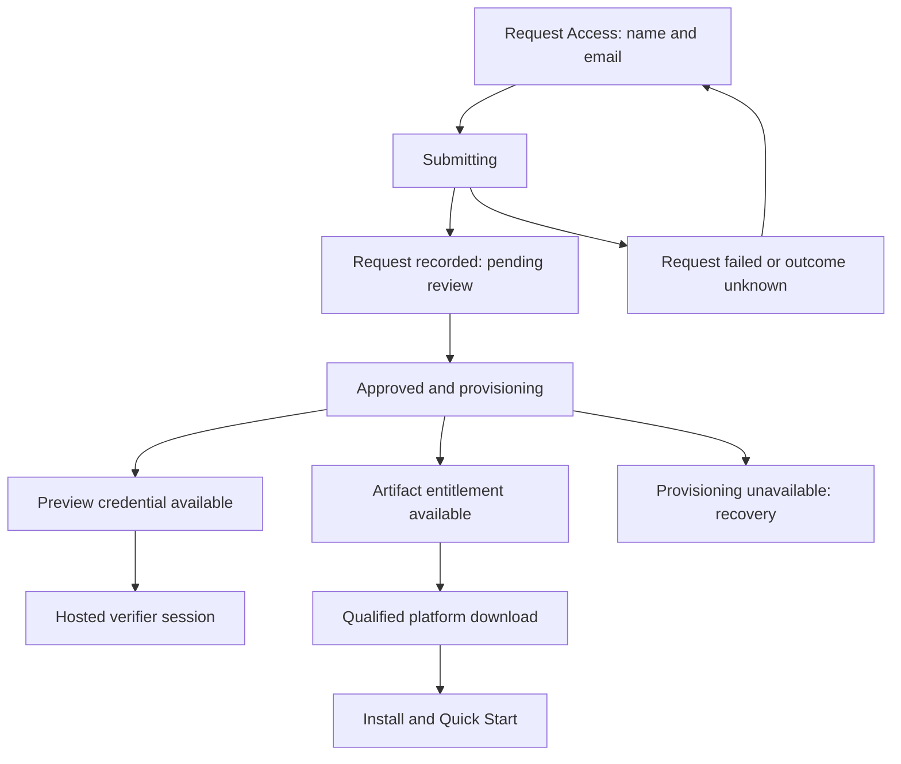
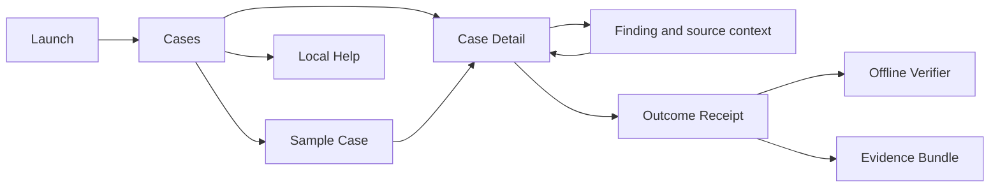

# Canonical UX blueprint — MMP11-UX-001

**Accepted by founder as the planning baseline under the subsequent controlled-implementation directive.** Baseline: `95708fade15efe583e25c6f5257e4bebe285f864`. This does not constitute deployed UX acceptance or runtime qualification. Changes to this working contract require documented decisions linked to task IDs.

## Experience contract

A first-time practitioner should be able to explain, in roughly one minute: VaultBasis independently reconciles supported broker and tax-ledger information; it preserves agreements, differences and unresolved evidence; it produces a portable verifiable Outcome Receipt; it does not establish source truth, tax correctness or legal compliance; evidence processing occurs locally in Edge, while website access and downloads are separate activities. They can then request access, evaluate a sample, or verify a receipt without founder explanation.

Use restraint, precision, strong readable typography, consistent spacing, obvious interaction hierarchy and deliberate state design. Avoid giant marketing typography, resource catalogs on the landing page, redundant cards, and legal text that overwhelms the primary task.

Protected: reconciliation, decimal arithmetic, parsers, canonicalization, supported limits, state/provenance semantics, signing, verification algorithms, receipt schema, evidence contract, Golden Corpus and vectors. Presentation may invoke and display them; it may not reinterpret them. If any proposed screen needs data the existing interface cannot supply without semantic change, stop that proposal for architecture review. Existing CSS and component structure are disposable implementation history.

## One public information architecture

Exactly one global header: **VaultBasis · How It Works · Trust Center · About | Verify Receipt · Request Access**. Brand returns home. How It Works points to `/#how-it-works`. Trust Center retains `/trust-assurance` initially to preserve links; its visible label is Trust Center everywhere. Verify Receipt goes to `/verifier`, preserving the server-side gate. Request Access opens the shared dialog, with a proposed `/request-access` full-page fallback using the same form/state model. No automatic new tab for internal routes; use external-context indicators only where an actual context change occurs.

Footer: one brand presentation and four groups:

| Product | Trust | Company | Legal |
|---|---|---|---|
| How It Works | Trust Center | About | Privacy |
| Verify Receipt | Scope & Limitations | Contact | Terms |
| Request Access | Security | | |

A concise limitation notice follows. Detailed schema/sample links live in Trust Center and verifier help. There is no second Report an Issue link to Contact. Existing `/faq` remains reachable from contextual Help; old fragments/routes redirect or retain valid targets without recreating a second global navigation.

| Surface | Content order | Primary action / success |
|---|---|---|
| Home | Hero → three values → How It Works → concise assurance boundary → local evidence processing → Outcome Receipt → Trust Center bridge → design-partner invitation | Request Access; user can describe purpose and limits before acting |
| Trust Center | Assurance Boundary → Local Evidence Processing → Outcome Receipt → Verification → Technical Evidence → Security → Privacy/governance references | Inspect evidence appropriate to question; subordinate local table of contents |
| About | Why VaultBasis exists → principles → what is being built → preview status → how to evaluate | Request Access; does not repeat whole homepage |
| Contact | General help / product issues → copyable contact → separate security route → privacy instruction | Open/copy address; disclose that delivery occurs in user's mail app; never claim sent |
| Access | Preview expectations → name/email and use of information → submission → truthful next state | Know what happened, what happens next, and what to do |
| Verifier access | Why this hosted capability requires preview access → credential form → request/recovery route | Authenticate and continue to intended verifier route without exposing credentials |
| Verifier | Local browser-processing explanation → select/drop receipt → distinct check results → limitation → help | Understand exactly what verified and what did not |
| Privacy / Terms / Security / Scope | Clear title, readable text, semantic section navigation where long, relevant contact or task return | Answer governance/support question without losing product context |
| Not found / unavailable | Human explanation → appropriate recovery → contact only if needed | Recover; correct HTTP status, no disguised homepage or raw JSON |

Long pages get a floating Back to top button after one viewport of scrolling. It disappears near the top, has visible focus and an accessible name, avoids mobile safe areas and controls, respects reduced motion, and places keyboard focus predictably at the top content landmark.

## Access is a stateful service journey

This is the proposed state model, not a claim these states currently exist. Engineering must implement durable service states before showing their labels. Do not show “under review” for automatic approval, “received” for an unpersisted request, “email sent” for a test sink, or a download before entitlement and artifact readiness. If pending requests cannot be safely persisted, show explicit unavailability instead of simulated success. No promised approval/delivery time until an operational owner establishes it.

The form validates name/email, associates field errors, retains entered values on recoverable failure, announces submitting/success/failure, prevents duplicate requests, and handles timeout as an unknown outcome rather than asserting nothing happened. Backend retry/idempotency behavior must avoid duplicate entitlements or email sends. Provisioning failure must not masquerade as a completed request.

Request confirmation contains next step and support recovery. Delivery uses an actually qualified transport; test SMTP stays out of the practitioner flow. Preview authentication and artifact entitlement remain separate server-side capabilities, even if one approval operation arranges both. Show platform and support requirements before downloading; unsupported/unavailable platforms never fall back to an older binary. Expired, revoked, wrong-artifact and invalid credentials fail closed with non-enumerating human guidance. No production form submission or communication is part of this audit.

## Verifier journey and semantics

The hosted verifier uses the common web shell with focused local content. The packaged offline verifier uses the Edge application context and requires neither website authentication nor internet access. Choosing online verification from Edge explicitly says it opens the website and may require preview access.

Receipt selection → working → structured result or designed error. File-picker and drag/drop paths are equivalent. Offer another receipt, clear/reset, sample guidance and help. Distinguish invalid input, unsupported contract, failed signature, missing prerequisite and runtime inability to perform a check; never turn an unexecuted check into FAIL or PASS. Preserve current normative short-circuit/report behavior; presentation changes must not reorder the algorithm or fabricate checks.

Always show separate results for Schema Conformance, Contract Compatibility, Receipt Key Self-Consistency and Signature Verification. **Tax Correctness: NOT DETERMINED** is visible regardless of cryptographic success. Source integrity is not implied by verifying a receipt alone; if supported verification includes evidence files, report only the authoritative checks actually performed.

Required concise explanation: “Verification establishes receipt-declared cryptographic properties. It does not independently authenticate the originating installation, establish source truth, determine tax correctness or establish legal compliance.” Preserve normative detailed notices without weakening this boundary.

## Edge application architecture

Edge is a work application. Its primary navigation is **Cases · Sample Case · Verify Receipt · Help**. The Verify Receipt action opens the local offline verifier and identifies that local behavior. Company/trust/online-verifier destinations are secondary, explicitly online, and do not replace local help.

| Surface | Intended presentation / interaction |
|---|---|
| Launch | Qualified native app opens workspace without Terminal, Python or repository. Startup error offers safe retry/help; no raw endpoint or port setup instructions as ordinary workflow. |
| Cases | Empty state offers New Case and Sample Case. Accessible new-case form only offers supported year/jurisdiction values; user sees those choices. Lists remain understandable without color. Pending creation cannot duplicate a case. |
| Sample Case | Clearly labeled synthetic evidence; explicit create/open action; source provenance remains truthful. Use existing supported sample inputs, never alter Golden Corpus expectations. Keep sample distinguishable from client cases. |
| Case Detail | Case identity → supported evidence selection → input status → Reconcile → authoritative outcome → findings/unresolved → receipt. Progress is indeterminate unless genuine progress exists. Preserve unknown vs zero and exact displayed values. |
| Finding | Accessible focused detail with reason, compared values, source references and existing provenance. Missing detail says unavailable; UI must not infer it. Back restores case and relevant focus. |
| Receipt | Human explanation and authoritative outcome first; declared signing-key information and JSON as detail. Obvious export and local verification. No “certified” or tax-valid badge. |
| Offline Verifier | Same result concepts as hosted verifier; packaged/local resources only; no session gate. |
| Help | Packaged Quick Start, supported scope, finding/receipt explanations and troubleshooting. Explicitly separate online support links. |
| External destination | Absolute approved HTTPS URL, meaningful label, context-change indication. Local state survives return or external network failure. |

Stable case navigation must support Back/Forward/reload without rerunning reconciliation. Reopen displays persisted authoritative results and receipt where supported. If the existing API does not expose persisted findings, architecture reviews the interface requirement before implementation. No new kernel behavior is implied. Failed operations must not leave apparent success, stale results from another case, or partially presented receipts.

## Interaction contract

Classify every concrete element in the implementation inventory. The live observation JSON contains the current public link/button inventory; source Edge elements are identified in the experience map. Before implementation, expand each family below into one row per element/state with a stable ID and destination. No unclassified element is allowed into the candidate.

Every row inherits: keyboard uses native link/button semantics, visible focus, and logical order; touch target at least 24×24 CSS px with applicable WCAG exceptions (44×44 preferred); mobile preserves hierarchy at 320 px; loading announced for asynchronous actions; human recovery for failure; no raw exceptions or credentials. Exceptions must be stated per row.

| ID / surface / element | User intent | Class | Action and destination/state | Loading / success / failure | Keyboard/mobile/accessibility specifics |
|---|---|---|---|---|---|
| I01 all web / brand, nav, footer links | Navigate | PUBLIC_PAGE or IN_PAGE | Canonical route table above | Native navigation; destination title/heading; designed error | Skip link; current-page indication; mobile menu Escape/close and focus return |
| I02 long pages / contents and top button | Locate section | IN_PAGE | Real stable anchor / top landmark | Immediate; target visible; missing anchor fails qualification | Reduced motion; sticky header cannot obscure focus; no mobile obstruction |
| I03 web / Request Access and close | Start/leave request | MODAL_ACTION | Shared dialog / invoker | Immediate; input focus / restored focus | Dialog title, containment, Escape, inert background, 200% zoom and mobile keyboard |
| I04 access / submit | Record request | MODAL_ACTION | Server-backed pending/approved/unavailable state | Submitting; truthful status; inline retry or unknown-outcome recovery | Enter submits; errors associated; success announced; preserve recoverable input |
| I05 verifier access / sign in | Enter hosted capability | AUTHENTICATED_WEB_CAPABILITY | Server validates credential, then intended verifier | Working; session; generic denied/expired/429/503 guidance | Paste allowed; credentials not echoed/logged; no stale protected page on history navigation |
| I06 verifier / select, drop, sample, reset | Inspect receipt | EDGE_LOCAL or AUTHENTICATED_WEB_CAPABILITY | Existing verifier invocation and result | Working; separate checks; invalid/unsupported/runtime state | Picker equivalent to drop; reset clears previous results; readable live summary |
| I07 Trust/verifier / schema and sample downloads | Inspect technical evidence | DOWNLOAD | Exact published schema or labeled synthetic sample | Browser download; named file; unavailable recovery | Purpose/type known before activation; do not call it tax validation |
| I08 access / Edge download | Install qualified product | DOWNLOAD | Entitlement + platform-bound qualified artifact | Pending; file + Quick Start; unavailable/expired/unsupported guidance | No fake link; accessible filename and support requirements |
| I09 Cases / New, Open, Refresh, Sample | Start/reopen work | EDGE ACTION | Existing local APIs and local view | Working; correct case; empty/failure recovery | Accessible form; stable focus; selected case persists on return |
| I10 Case / evidence select and reconcile | Compare sources | EDGE ACTION | Existing intake/reconciliation | Working; authoritative outcome; safe typed failure | Keyboard picker; no double run; no fabricated progress or inferred match |
| I11 Case/Finding / inspect and Back | Understand evidence | EDGE LOCAL PAGE | Focused finding / retained case | Loading if needed; source context; unavailable detail | Table headers; focus returns to originating finding |
| I12 Receipt / view/export/verify | Retain and verify outcome | EDGE LOCAL PAGE / DOWNLOAD / EDGE_LOCAL | Persisted receipt, evidence bundle, local verifier | Pending; correct receipt/file; designed error | Announce state; JSON has human explanation; no accidental hosted verifier |
| I13 Help / guides | Get assistance offline | PACKAGED_RESOURCE | Local rendered documentation | Available offline; missing-resource recovery | Readable landmarks/headings; never raw markdown destination |
| I14 Edge / website, hosted verifier, support | Use online capability | PUBLIC WEBSITE / WEB VERIFIER / EXTERNAL | Absolute deliberate destination | External navigation; local case retained; offline explanation | Context change conveyed; email address copyable; no taxpayer uploads |

For cross-surface inventories normalize Edge-specific labels to EDGE_LOCAL / PUBLIC_PAGE / AUTHENTICATED_WEB_CAPABILITY while retaining the explicit Edge classification. Reject empty href, bare `#`, `javascript:`, dead fragments, raw markdown pages, unintended loopback links, framework errors, stale release links and unqualified downloads.

## Visual and state system

Freeze one mark geometry and wordmark, font family, type hierarchy, spacing scale, radii, button hierarchy, focus treatment, status vocabulary and icon language after blueprint acceptance. Use existing brand identity as evidence of recognition, not a mandate to reuse existing CSS.

Proposed starting specification: system-native sans-serif (offline-safe), monospace for identifiers/data; 16 px body with 1.5 line height, 14 px small/labels, H1 32–40 px, H2 24–28 px, H3 20 px. Use a 4/8/12/16/24/32/48 spacing scale and restrained 6–8 px control/card radii. Reading columns approximately 65–75 characters; Edge uses denser task layout with equally readable controls. Values are design proposals to verify at zoom/reflow, not accessibility certification.

Semantic tokens: text-primary, text-secondary, text-muted, surface, surface-secondary, border, focus, interactive, interactive-hover, success, warning, error. Candidate color pairs must meet WCAG AA text/non-text requirements; no arbitrary per-page grays or color-only status. Tables preserve headers and labels on narrow views, using deliberate labeled scrolling where intrinsically two-dimensional. Cards group actual tasks, not every paragraph. No new dark mode, tracking, remote Edge fonts or effect-only dependencies.

Every async component specifies idle/working/success/failure/retry. Every collection specifies loading/empty/populated/unavailable. Every gate specifies anonymous/valid/invalid/expired/revoked/rate-limited/service-unavailable. Every page has a title, main landmark, skip path and designed error recovery. Errors explain what happened and a safe next action; data-preservation statements require evidence rather than blanket reassurance.

## Acceptance and delivery

Observe unfamiliar practitioners at the protected candidate: explain purpose/boundaries within roughly one minute; choose access, sample evaluation or receipt verification; complete the chosen action; explain the result and its limits. Record task completion, confusion, founder interventions, contradictions and recovery. Do not coach through a defect and mark success. No critical contradiction/dead end/engineering artifact is acceptable. Founder decides professional credibility and acceptance on the actual complete candidate.

Sequence: finish live/native audit → review this single IA and interaction blueprint → implement shared system and complete journeys → run functional/a11y/security/semantic regression gates → build exact candidate → protected pre-production deployment → every-route/action browser crawl → desktop/mobile matrix → keyboard/VoiceOver/native recipient path → one complete founder review → acceptance fixes → requalification → immutable promotion → production smoke → freeze. Visual regression baselines are established only after design acceptance.

Work ownership remains split: UX covers web/Edge presentation; release/security owns artifact identity, email, entitlements and deployment-boundary verification; later product research may proceed without touching this protected kernel/release scope. Associate-001 starts after bounded external-release blockers close; minor aesthetic refinement is not a reason to delay it.
